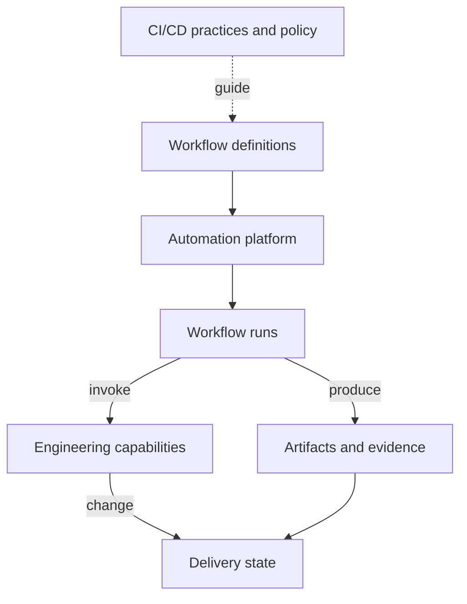
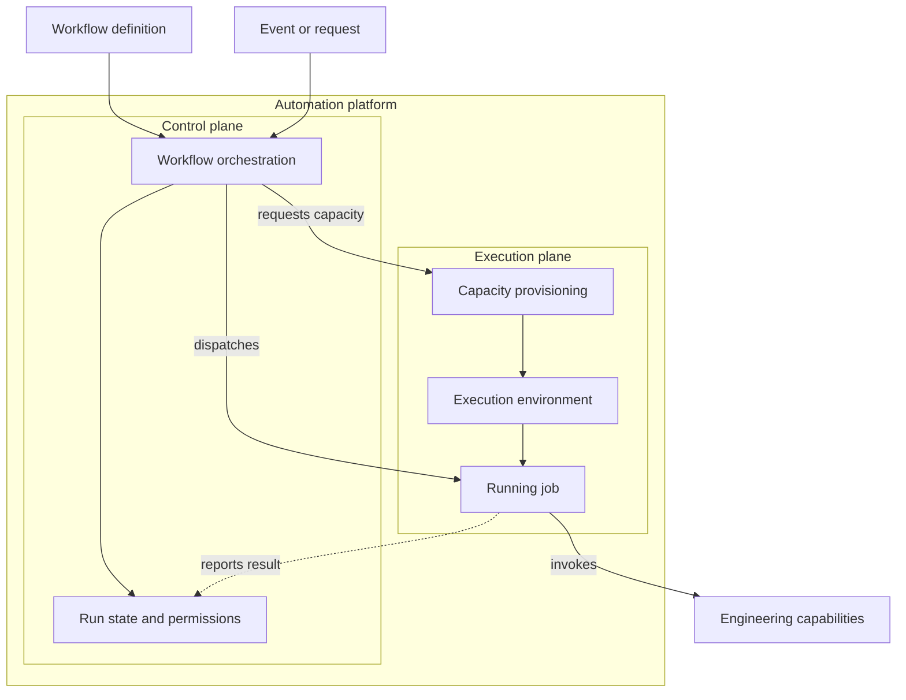
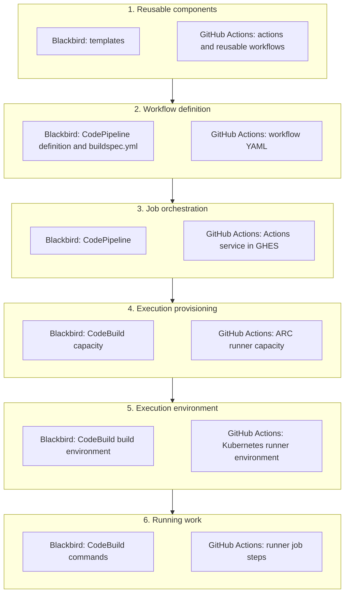
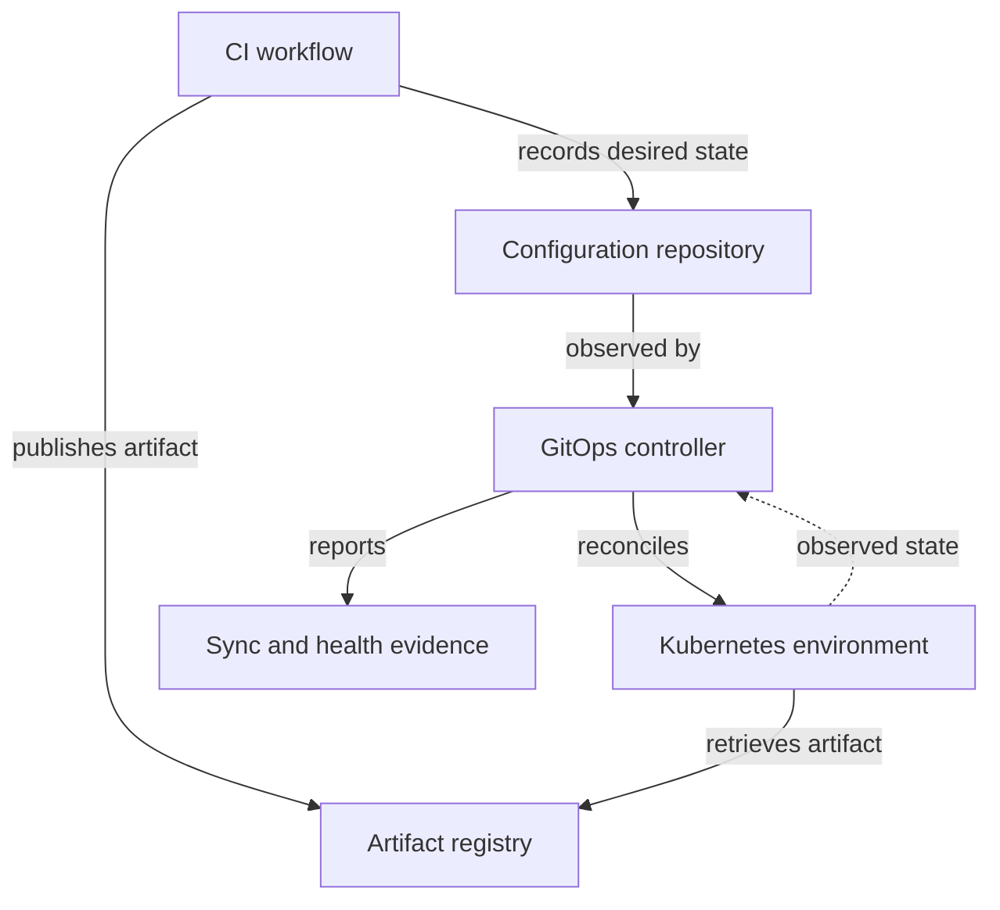
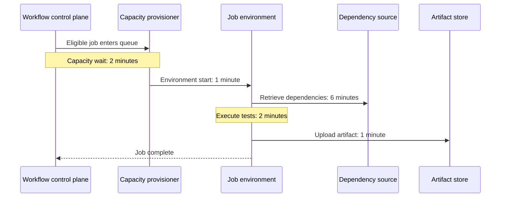

## 1. The problem with saying “CI/CD”

I keep running into conversations where someone says, “Our CI/CD is slow,” and everyone in the room appears to agree. A few minutes later, it becomes clear that they are describing different delays.

The developer means their test suite takes twenty minutes. The platform engineer means jobs wait ten minutes for a runner. The security engineer means an external scan holds up promotion. The release manager means production deployments spend days awaiting approval. All four observations could be true. Fixing one of them may do nothing for the others.

The same confusion shows up in incidents and migrations. “CI/CD is down” might point to the workflow service, runner capacity, an artifact repository or the deployment target. “Migrating CI/CD” might mean changing workflow definitions, replacing orchestration, moving execution infrastructure or redesigning release practice. The conversation tends to settle on whichever tool made the problem visible. A failed dependency download becomes a “GitHub Actions issue” because that is where the error appeared.

A useful opening question is:

> **Which part of the delivery system are we talking about?**

The answer needs a model that people who design, operate, secure and use delivery systems can share. The categories below describe responsibilities and relationships; a product, service or team may span several of them.

### Relationship to existing work

The Continuous Delivery Foundation described a related vocabulary effort in 2020, recognising that projects use different terms for similar concepts. [CDF shared vocabulary initiative][cdf]

The architectural distinctions also have a longer history. The Workflow Management Coalition's reference model separated process definitions, workflow execution services, invoked applications and administration. Continuous Delivery literature connected automated activities with the broader delivery process. More recently, SLSA has made build execution and trust boundaries explicit. [WfMC reference model][wfmc] [Continuous Delivery, chapter 5][delivery-book] [SLSA build terminology][slsa]

I use these earlier ideas to make a more specific distinction: what is the practice, what runs the automation, what does the work, and what establishes the outcome? The resulting vocabulary is a working convention for architecture discussions, incidents and migration plans. It is a synthesis, not an industry standard.

## 2. CI/CD as a practice

The terms begin as practices. **Continuous Integration** means integrating changes into a shared mainline frequently and validating them through automated builds and tests. The point is to find integration problems while the changes are still small and the people who made them still have the context to fix them. An automated check on an isolated branch is useful; it says little about how often that branch is integrated. [Fowler, Continuous Integration][ci]

**Continuous Delivery** means keeping software in a state from which it can be released reliably when required. **Continuous Deployment** takes qualifying changes into production automatically. A manual approval can be a deliberate policy choice. It cannot, by itself, establish whether the software behind the button is actually ready to release. [Fowler, Continuous Delivery][cd]

Deployment and release also need explicit meanings. In this paper, *deployment* changes software or configuration in a target environment. *Release* makes a selected capability or version available to its intended consumers. These can happen together, but mechanisms such as feature flags can separate them. For a library or desktop application, publication and distribution may be more relevant than deploying a service.

An organisation can run thousands of automated jobs and still integrate late or spend weeks making a release safe. DORA's account of Continuous Delivery includes testing, architecture and organisational capabilities alongside automation. Where the bottleneck is batch size, testability or release policy, adding more workflow machinery will have limited effect. [DORA, Continuous delivery][dora-cd]

## 3. A working model of the system

The questions below pull apart concerns often compressed into “CI/CD.” They are different views of a delivery system, rather than successive layers of one technology stack. A practice, a stored definition, a running process and an observed outcome cannot be diagnosed or owned in quite the same way.

| Concern | Question it answers | Examples |
| --- | --- | --- |
| Practice and policy | How do we integrate, validate and release changes? | Integration frequency, readiness criteria, release decisions |
| Workflow definition | What work should occur, and under what conditions? | Workflow YAML, pipeline configuration, buildspecs, reusable components |
| Workflow execution | Which instance of that work are we observing? | A run, its jobs, inputs, attempts, results and timestamps |
| Control plane | What interprets intent and coordinates work? | Events, conditions, dependencies, scheduling, dispatch and run state |
| Execution provisioning | How does suitable capacity become available? | Worker allocation, runner scaling, VM or pod creation |
| Execution environment | What resources and authority does the work receive? | Runner, runtime, workspace, network access, credentials and isolation |
| Invoked capability | What specialised tool or service performs an activity? | Compiler, test framework, scanner, registry, signing or deployment service |
| Delivery outcome | What changed, and what evidence establishes it? | Validated source, published artifact, approved promotion or healthy deployment |

The wider **software delivery system** also includes source control, artifact management, environments, operational feedback, governance and people. A change may cross several automation engines on its way to users. The work can continue long after an individual workflow reports success.

Figure 1 shows how the concerns relate without pretending every delivery path follows the same sequence:

*Figure 1. A map of concepts, not a mandatory sequence of services. A run can invoke several capabilities, produce several outputs and participate in a delivery path that continues beyond it.*

### Define the platform boundary

I use **automation platform** for the services that coordinate workflows and provide or arrange their execution. An organisation's **delivery platform offering** may be wider: registries, scanners, deployment services, templates, documentation and support may all be part of what its users receive.

That wider offering is often what engineers mean when they say “our platform.” CNCF describes a platform as an integrated collection of capabilities presented according to users' needs, including capabilities supplied by others. A scanner can be part of the offering while remaining a separately operated service with its own failure modes. [CNCF Platforms White Paper][platforms]

The boundary matters the moment something fails. “The platform team owns scanning” might mean it operates the scanner, integrates another team's service or maintains the workflow templates that call it. Those arrangements give the team very different ways to investigate and repair a failure.

### Definition, execution and engine

A **workflow definition** describes intended automation. A **workflow execution**, or run, is what happens when that definition is evaluated with particular inputs. The **workflow engine** interprets the definition and coordinates the work. Reusable components contribute behaviour too, and their versions can change what a run actually does.

GitHub Actions illustrates the distinction through workflow files, workflow runs, jobs and runners. The file declares automation; an event initiates a run; the service coordinates jobs; and runners execute them. These are related objects with different identities and lifetimes. [GitHub Actions concepts][github]

The run is not the machine or container it uses. It may span several jobs and several environments; a retry may create another attempt on another worker. If an investigation records only the run ID, it can miss the environment where the failure occurred. Keep the run, job attempt and environment identifiable separately.

### Delivery pipeline and automation workflow

“Pipeline” has several established uses. Humble and Farley's deployment pipeline describes the process through which a change progresses from version control towards users, including validation and decisions. Individual products also use pipeline for a configured graph or a particular execution. [Continuous Delivery, chapter 5][delivery-book]

I use **delivery pipeline** for the broader path by which a change is evaluated and made available, and **workflow** for the automation that coordinates some part of that path. Product-specific terms remain useful when their scope is clear. One delivery pipeline may involve several workflows, artifact promotions, human decisions and deployment controllers.

## 4. Inside the automation platform

An automation platform accepts an event or request, selects a definition, evaluates its conditions, schedules eligible work, obtains capacity and tracks the result. The same machinery can build software, test a change, generate documentation or administer a repository. Running a workflow on it says nothing, on its own, about whether the organisation practises Continuous Integration or Delivery. [GitHub Actions concepts][github]

The next diagram opens up the automation platform from Figure 1. It separates the responsibilities that coordinate work from the environment in which job code runs.

*Figure 2. Logical platform responsibilities. Provisioning can contain control logic of its own, while the execution environment supplies the resources and authority available to a running job.*

Figure 2 draws the narrower automation boundary. A capability invoked by a job may run inside its environment or in another service altogether. The broader platform offering may include that capability, while identity, governance and observability still cross the boxes in the diagram.

### The control plane

The control plane manages the lifecycle of work: accepting events, interpreting definitions, creating runs, enforcing conditions, scheduling jobs, coordinating dependencies and exposing state. Depending on the implementation, it may also mediate access to credentials and apply policy, with some decisions delegated to external services.

When a run stalls, establish whether the event was accepted, why a job is waiting, which attempt owns a result and whether cancellation reached the executing process. The coordinator's state can also differ from the state of a system it called. A job might lose its connection after submitting a deployment request; the workflow has an error, but the deployment may still be under way.

That uncertainty changes how retries should work. Repeating a read or a test is usually different from repeating an artifact publication, an infrastructure change or a release operation. The workflow and the downstream service need enough shared identity to establish what already happened before trying again.

### Execution provisioning and environments

Provisioning finds or creates capacity; execution spends time using it. A ten-minute wait for a worker and a ten-minute test run may look identical on a dashboard showing only total duration. They require different repairs.

The environment supplies compute, runtime dependencies, workspace, network reachability and authority. The runner application, its VM or pod, a job container and the process executing a command may be separate objects. “The runner failed” is a starting point for diagnosis, not yet a cause.

Provisioning can itself involve controllers, schedulers and state. In a Kubernetes-based implementation, the workflow engine, runner controller and cluster scheduler make different decisions. The control/execution distinction is relative to the system under discussion: a runner provisioner contains control logic even though its purpose is to support workflow execution.

### Execution is a trust boundary

SLSA's build model explicitly separates a platform control plane from tenant-defined steps running in a build environment. It also allows that environment to comprise multiple machines in a distributed build. The model provides a precise reference for the distinction, while this paper applies similar reasoning to automation beyond builds. [SLSA v1.2 terminology][slsa]

In practice, a workflow may run code from a repository, a dependency or a reusable component. That code receives whatever authority the environment and credentials make available. A review of the YAML alone is incomplete: who can trigger it, change its inputs, supply code or reach a privileged system from the runner?

The relevant trust boundary may extend beyond an individual service or team. SLSA defines the build platform in terms of the components and parties that must be trusted for faithful execution. An organisational ownership diagram and a security diagram can consequently have different boundaries. [SLSA v1.2 terminology][slsa]

## 5. How five CI/CD systems implement the model

GitHub Actions, Jenkins, GitLab CI/CD, Azure Pipelines and a composition of AWS CodePipeline and CodeBuild all perform some version of these responsibilities. Their boundaries and terminology differ, so product names alone are a poor substitute for the model. The table shows representative configurations; runner, agent and integration choices vary by installation.

| System | Definition and coordination | Provisioning and execution |
| --- | --- | --- |
| GitHub Actions | Workflow YAML under `.github/workflows/`; the Actions service evaluates triggers and coordinates runs and jobs | GitHub-hosted or self-hosted runners execute jobs; Actions Runner Controller (ARC) can manage self-hosted runner capacity on Kubernetes |
| Jenkins | A `Jenkinsfile` can define a Pipeline in source control; the Jenkins controller coordinates its execution | Jenkins agents supply executors and workspaces; infrastructure that supplies agents depends on the installation and its integrations |
| GitLab CI/CD | `.gitlab-ci.yml` defines jobs and stages; GitLab creates pipelines and makes jobs available to matching runners | GitLab Runner prepares job environments and executes commands, using hosted or self-managed runner arrangements |
| Azure Pipelines | YAML or Classic definitions describe stages, jobs and steps; Azure Pipelines coordinates runs | Jobs generally run on agents in pools, using Microsoft-hosted agents in Azure DevOps Services or self-hosted agents; some jobs are agentless |
| AWS CodePipeline / CodeBuild | A CodePipeline definition coordinates stages and actions; a CodeBuild `buildspec.yml` defines commands for a build action | CodeBuild creates its configured build environment and executes commands; CodeBuild can also be used without CodePipeline |

The rows identify responsibilities, not interchangeable products. A Jenkins controller may coordinate agents supplied by another platform; the AWS example combines two services; GitLab Runner both prepares an environment and executes work. An organisation that operates its own runners also owns work that a hosted service might otherwise absorb. [Understanding GitHub Actions][github] [Using a Jenkinsfile][jenkinsfile] [Using Jenkins agents][jenkinsagents] [Get started with GitLab CI/CD][gitlabci] [GitLab runners][gitlabrunners] [Azure Pipelines concepts][azureconcepts] [Azure Pipelines agents][azureagents] [CodePipeline concepts][codepipeline] [CodeBuild concepts][codebuild]

### An applied comparison: GitHub Actions and Blackbird

**Blackbird is a bespoke internal CI/CD service built around AWS services.** In the architecture shown here, it combines Blackbird templates with AWS CodePipeline and CodeBuild to provide an organisation-specific delivery offering. The comparison uses an internally operated GitHub Actions configuration with GitHub Enterprise Server (GHES) and Actions Runner Controller (ARC).

This comparison developed from an architecture diagram I created to explain the responsibilities within the two internal offerings. The technologies differ, but both need reusable components, definitions, orchestration, capacity, an execution environment and running work. Figure 3 puts each corresponding responsibility on the same row, with Blackbird on the left and GitHub Actions on the right:

*Figure 3. Each numbered stage contains the corresponding Blackbird and GitHub Actions components. The downward arrows show the progression from reusable material to running work; either implementation may invoke build, scan, artifact and deployment capabilities.*

The diagram describes one internal design, not every way either technology can be deployed. CodePipeline coordinates stages and actions; CodeBuild establishes a build environment and executes its commands. On the other side, GitHub Actions coordinates jobs while ARC manages capacity for the self-hosted runners that execute them. [CodePipeline concepts][codepipeline] [CodeBuild concepts][codebuild] [Actions Runner Controller][arc]

The difference is operational as well as architectural. Running your own capacity brings images, isolation, networking and scaling into your responsibility. Moving from one offering to the other might change definitions, orchestration, capacity or an invoked capability. Each deserves its own compatibility checks; changing the workflow syntax will not settle the rest.

## 6. Workflows, capabilities and the wider delivery system

A workflow can obtain source, build and test software, request a scan, publish an artifact and initiate deployment. Some commands do the work locally; others ask a remote service to begin work that continues after the command returns. The workflow file describes the intended work, but may not reveal where it happens or how its outcome is established. Google's release-engineering account shows this kind of composition across release, build and packaging systems. [Google SRE, Release Engineering][sre]

### Deployment through reconciliation

GitOps makes the handoff unusually clear. OpenGitOps describes declarative, versioned desired state that another system pulls and continuously reconciles. A CI workflow can publish an artifact, update that state and finish successfully while the environment has yet to change. [OpenGitOps Principles v1.0.0][gitops]

Argo CD and Flux are two concrete implementations of the Kubernetes delivery side of this model. In Argo CD, an `Application` links desired and live state and exposes sync and health status; automated sync depends on its configuration. In Flux, source resources such as `GitRepository` or `OCIRepository` provide inputs to controllers, while resources such as `Kustomization` describe what to reconcile. Flux may thus reconcile desired state distributed through Git or an OCI registry. These implementation details differ, but in either case a successful CI run or desired-state update alone does not establish that the target environment converged or that the application is ready. [Argo CD core concepts][argoconcepts] [Argo CD, Automated Sync Policy][argo] [Flux core concepts][fluxconcepts]

*Figure 4. A representative Git-sourced Kubernetes delivery path. Artifact publication and a change to desired state can finish before the controller reconciles the environment and reports the observed result. Flux can also consume desired state from an OCI registry.*

Any of the five CI/CD implementations can publish an artifact and update desired state for Argo CD or Flux. Three separate questions follow: was the artifact published, did the controller reconcile the intended state, and is the application ready? If reconciliation stalls, rebuilding an artifact that was already published is unlikely to help.

### Completion, evidence and outcome

A green workflow run reports success under the workflow's configured conditions and the platform's status rules. It does not establish that every intended check ran or that the downstream outcome was achieved. Its meaning depends on which inputs were used, what those checks covered and whether anyone observed the downstream result. A successful request to deploy does not establish that the deployment converged or that users can reach a healthy service.

The in-toto model addresses another part of this problem by linking supply chain steps and artifacts through verifiable metadata. NIST's guidance similarly treats evidence integrity as a concern across delivery activities. These approaches help establish relationships that an isolated job status cannot express. [in-toto][intoto] [NIST SP 800-204D][nist]

For a particular delivery path, distinguish the questions explicitly:

| Question | Evidence needed |
| --- | --- |
| Did the automation complete as configured? | Run and job results, including skipped work, attempts and relevant inputs |
| Which artifact resulted from which source and process? | Identified inputs and outputs, with provenance appropriate to the trust requirements |
| Was that artifact authorised for promotion? | A policy decision tied to the artifact's identity |
| Did the environment reach the intended state? | Deployment observations and application-specific readiness checks |
| Is the capability available to its intended users? | Release configuration and relevant service or product observations |

These observations depend on the delivery architecture. A signature authenticates a statement under a particular identity and trust model; it says only what that statement and its scope support. Provenance and authenticated test results can make the delivery path more trustworthy without proving that the software is correct in every circumstance.

### Interfaces between delivery systems

Delivery systems hand work to one another through APIs, repository changes, published artifacts and events. At each handoff, enough identity has to survive to answer a simple question later: which change and artifact led to which execution and observed state?

CDEvents is one effort to give delivery tools a shared event vocabulary. That can make integration contracts clearer, but a common event name does not decide what counts as completion, who trusts the event or how to recover when its consumer fails. Those remain design decisions at the actual boundary. [CDEvents whitepaper][cdevents]

## 7. Why boundaries change engineering decisions

The model earns its keep when it changes what someone investigates or which decision they make. The table turns familiar claims into questions about a particular responsibility or handoff.

| Statement | Questions to ask before acting |
| --- | --- |
| “CI/CD is slow.” | Where is time spent: event processing, queueing, provisioning, active work, remote services, approvals or deployment convergence? |
| “CI/CD is down.” | Which service or transition is unavailable, and which delivery paths are affected? |
| “We need to secure CI/CD.” | Who can influence execution, what authority does it receive, and how are outputs verified before use? |
| “We need to migrate CI/CD.” | Which definitions, execution services, capabilities, policies and integrations are changing? |
| “CI/CD deployed a bad release.” | Which component selected the artifact, authorised promotion, changed state and checked the result? |

### Measure time at meaningful boundaries

Consider an illustrative twelve-minute path:

*Figure 5. One sequential critical path, not timings measured from a particular platform. Dependency retrieval accounts for half the elapsed time in this example.*

Measure event acceptance, job eligibility, queue entry, environment readiness and downstream completion as distinct boundaries. Provisioning can overlap with queueing, and parallel jobs overlap one another, so adding every job duration together will misstate elapsed time. In Figure 5, dependency retrieval is the largest term on the critical path. Faster runners would not necessarily fix it.

Queue latency and runner availability describe the automation service. DORA's delivery metrics describe application or service delivery in context. Use both to understand performance at their respective boundaries. A faster runner queue alone does not establish that users are receiving changes faster. [DORA's software delivery performance metrics][dora-metrics]

### Classify failures by what failed

An unavailable worker, a failed test and an unhealthy deployment need different repairs. A failed test may mean the automation did its job and found an application problem. A platform failure may prevent the test from starting at all. A deployment can still fail after the workflow has submitted its request and exited.

OpenTelemetry's CI/CD span conventions make part of this distinction explicit: a system error is distinguished from a workload failure such as a compile or test failure. The conventions were marked Release Candidate when consulted, so the terminology is a useful implementation example rather than a permanent schema assumption. [OpenTelemetry CI/CD spans][otel]

Report what the developer experienced and what actually failed. Knowing the responsible component should speed restoration, not send the developer on a tour of team boundaries.

### Assign responsibility without creating unnecessary handoffs

A platform team may operate runner capacity while application teams own workflows and other teams operate scanners or deployment systems. Those boundaries are useful for repair, but somebody still needs to coordinate restoration of the service experienced by developers. Record both the component owner and that coordinating responsibility. Otherwise a perfectly accurate ownership diagram can leave an incident sitting between teams.

Clear interfaces should make it easier for teams to change, test and deploy independently, consistent with DORA's account of loosely coupled teams. The categories in this paper help locate decisions and failures; they are not a reason to introduce an approval queue at every boundary. [DORA, Loosely coupled teams][dora-teams]

### Trace authority and evidence through the delivery path

For security, follow authority from the trigger to the downstream effect. Who can edit the workflow, influence its inputs, supply code, obtain credentials and authorise promotion? NIST SP 800-204D discusses controls across these activities. A hardened runner cannot compensate for an unauthorised promotion decision made elsewhere. [NIST SP 800-204D][nist]

Every accepted assertion needs a subject and a scope. “The scan passed” needs an identified artifact. “The deployment succeeded” needs an observation that defines success. Otherwise the next system in the chain can accept a true statement about the wrong thing.

### Scope migrations as several explicit changes

Replacing a workflow engine may leave the same tests, dependencies, credentials and approval delays in place. That can be a sensible first step, but it should not be presented as a complete change to delivery speed, isolation or release practice. Give those improvements their own requirements.

A useful migration plan distinguishes:

- **Definition semantics:** triggers, conditions, dependencies, retries, cancellation and approvals.
- **Execution behaviour:** runtime, filesystem, networking, identity, resource limits and isolation.
- **Capability integration:** builds, scans, artifacts, signing and deployment interfaces.
- **Operational behaviour:** observability, retention, recovery, support and cost allocation.
- **Delivery policy:** the decisions and criteria governing promotion and release.

Syntax translation covers only part of the first category. If the rest are unnamed, they tend to reappear later as migration surprises.

## 8. Putting the model to work

Take one delivery path that matters to your team and follow it from the initiating change to an observable outcome. At each handoff, record the input, responsible component, identity, output, evidence and repair owner. A real path will reveal more than a diagram of products assembled from memory.

| Record | What to capture |
| --- | --- |
| Practice and intent | The delivery objective and conditions for proceeding |
| Definition | The workflow, reusable components, relevant versions and owner |
| Execution | Run, job and attempt identities, with resolved inputs |
| Coordination and provisioning | The services that schedule work and allocate capacity |
| Environment | Runtime, isolation, identity, network access and resource constraints |
| Capabilities and interfaces | Local tools, remote services and their completion semantics |
| Artifacts and decisions | Identified outputs, evidence and promotion authorisation |
| Outcome | Intended state, observed state and responsibility for verification |

That record may expose a job that was dispatched but never obtained an environment, an artifact whose origin cannot be established, or desired state that changed without the environment converging. Use it during an incident, a security review or a migration plan. When the real path differs from the model, update the model.

CI/CD is useful shorthand when everyone means roughly the same thing. When a decision matters, be more specific: **which responsibility or boundary are we discussing, who can act there, and what evidence would establish the intended outcome?** The model earns its place when those questions lead to better engineering decisions.

## References

Foundational publications and versioned specifications support the conceptual model. Living documentation supports specific implementation details. Online sources were consulted on 16 September 2026; versions are identified where material.

1. Fatih Degirmenci. [How the CDF is Establishing a Shared Vocabulary for the Industry][cdf]. Continuous Delivery Foundation, 24 April 2020. The product mapping is historical.
2. Martin Fowler. [Continuous Integration][ci]. Article originally published in 2001; consulted revision dated 18 January 2024.
3. Martin Fowler. [Continuous Delivery][cd]. 30 May 2013; updated 12 August 2014.
4. Jez Humble and David Farley. *Continuous Delivery: Reliable Software Releases through Build, Test, and Deployment Automation*. Addison-Wesley, 2010. [Chapter 5 excerpt: What Is a Deployment Pipeline?][delivery-book]
5. DORA. [Continuous delivery][dora-cd]. Living capability guide and research synthesis.
6. David Hollingsworth. [The Workflow Reference Model][wfmc]. Workflow Management Coalition, TC00-1003, Issue 1.1. Consulted University of Edinburgh archive copy dated 29 November 1994.
7. SLSA project. [SLSA v1.2: Build terminology and model][slsa]. Approved specification.
8. CNCF TAG App Delivery. [Platforms White Paper][platforms]. Living whitepaper.
9. GitHub. [Understanding GitHub Actions][github]. Workflow, job, step and runner concepts.
10. Amazon Web Services. [AWS CodeBuild concepts][codebuild]. Build definitions and execution environments.
11. Amazon Web Services. [CodePipeline concepts][codepipeline]. Pipelines, stages, actions and executions.
12. GitHub. [Actions Runner Controller][arc]. Runner provisioning, scaling and dispatch architecture.
13. Dinah McNutt. [Release Engineering][sre]. Chapter 8 of *Site Reliability Engineering*, O'Reilly, 2016.
14. OpenGitOps. [Principles][gitops], [version 1.0.0 release][gitops-release].
15. Argo CD project. [Automated Sync Policy][argo]. Living implementation documentation.
16. Santiago Torres-Arias, Hammad Afzali, Trishank Karthik Kuppusamy, Reza Curtmola and Justin Cappos. [in-toto: Providing farm-to-table guarantees for bits and bytes][intoto]. USENIX Security, 2019, pp. 1393–1410.
17. Ramaswamy Chandramouli, Frederick Kautz and Santiago Torres-Arias. [Strategies for the Integration of Software Supply Chain Security in DevSecOps CI/CD Pipelines][nist]. NIST SP 800-204D, February 2024.
18. OpenTelemetry. [Semantic conventions for CI/CD spans][otel]. Consulted in semantic conventions 1.44.0; CI/CD conventions marked Release Candidate.
19. DORA. [DORA's software delivery performance metrics][dora-metrics]. Living guide.
20. DORA. [Loosely coupled teams][dora-teams]. Living capability guide and research synthesis.
21. Continuous Delivery Foundation. [CDEvents: The Next Evolution in CI/CD Technology][cdevents]. June 2023 whitepaper.
22. Jenkins project. [Using a Jenkinsfile][jenkinsfile] and [Using Jenkins agents][jenkinsagents]. Living implementation documentation.
23. GitLab. [Get started with GitLab CI/CD][gitlabci] and [Runners][gitlabrunners]. Living implementation documentation.
24. Microsoft. [Key Azure Pipelines concepts][azureconcepts] and [Azure Pipelines agents][azureagents]. Living implementation documentation; hosted agent options depend on service deployment.
25. Argo CD project. [Core concepts][argoconcepts]. Living implementation documentation.
26. Flux project. [Core concepts][fluxconcepts]. Living implementation documentation, including Git and OCI sources.

[cdf]: https://cd.foundation/blog/2020/04/24/how-the-cdf-is-establishing-a-shared-vocabulary-for-the-industry/
[ci]: https://martinfowler.com/articles/continuousIntegration.html
[cd]: https://martinfowler.com/bliki/ContinuousDelivery.html
[delivery-book]: https://www.informit.com/articles/article.aspx?p=1621865&seqNum=2
[dora-cd]: https://dora.dev/capabilities/continuous-delivery/
[wfmc]: https://www.aiai.ed.ac.uk/project/wfmc/ARCHIVE/DOCS/refmodel/rmv1-16.html
[slsa]: https://slsa.dev/spec/v1.2/terminology
[platforms]: https://tag-app-delivery.cncf.io/whitepapers/platforms/
[github]: https://docs.github.com/en/actions/get-started/understand-github-actions
[codebuild]: https://docs.aws.amazon.com/codebuild/latest/userguide/concepts.html
[codepipeline]: https://docs.aws.amazon.com/codepipeline/latest/userguide/concepts.html
[arc]: https://docs.github.com/en/actions/concepts/runners/actions-runner-controller
[sre]: https://sre.google/sre-book/release-engineering/
[gitops]: https://opengitops.dev/
[gitops-release]: https://github.com/open-gitops/documents/releases/tag/v1.0.0
[argo]: https://argo-cd.readthedocs.io/en/stable/user-guide/auto_sync/
[intoto]: https://www.usenix.org/conference/usenixsecurity19/presentation/torres-arias
[nist]: https://csrc.nist.gov/pubs/sp/800/204/d/final
[otel]: https://opentelemetry.io/docs/specs/semconv/cicd/cicd-spans/
[dora-metrics]: https://dora.dev/guides/dora-metrics/
[dora-teams]: https://dora.dev/capabilities/loosely-coupled-teams/
[cdevents]: https://cd.foundation/wp-content/uploads/sites/35/2023/06/CDEvents_Whitepaper_June_7_2023.pdf
[jenkinsfile]: https://www.jenkins.io/doc/book/pipeline/jenkinsfile/
[jenkinsagents]: https://www.jenkins.io/doc/book/using/using-agents/
[gitlabci]: https://docs.gitlab.com/ci/
[gitlabrunners]: https://docs.gitlab.com/ci/runners/
[azureconcepts]: https://learn.microsoft.com/en-us/azure/devops/pipelines/get-started/key-pipelines-concepts?view=azure-devops
[azureagents]: https://learn.microsoft.com/en-us/azure/devops/pipelines/agents/agents?view=azure-devops
[argoconcepts]: https://argo-cd.readthedocs.io/en/stable/core_concepts/
[fluxconcepts]: https://fluxcd.io/flux/concepts/

## Suggested citation

Murphy, Damien. *Unpacking CI/CD: A Systems Model for Software Delivery Automation*. Version 1.0, 17 September 2026.
