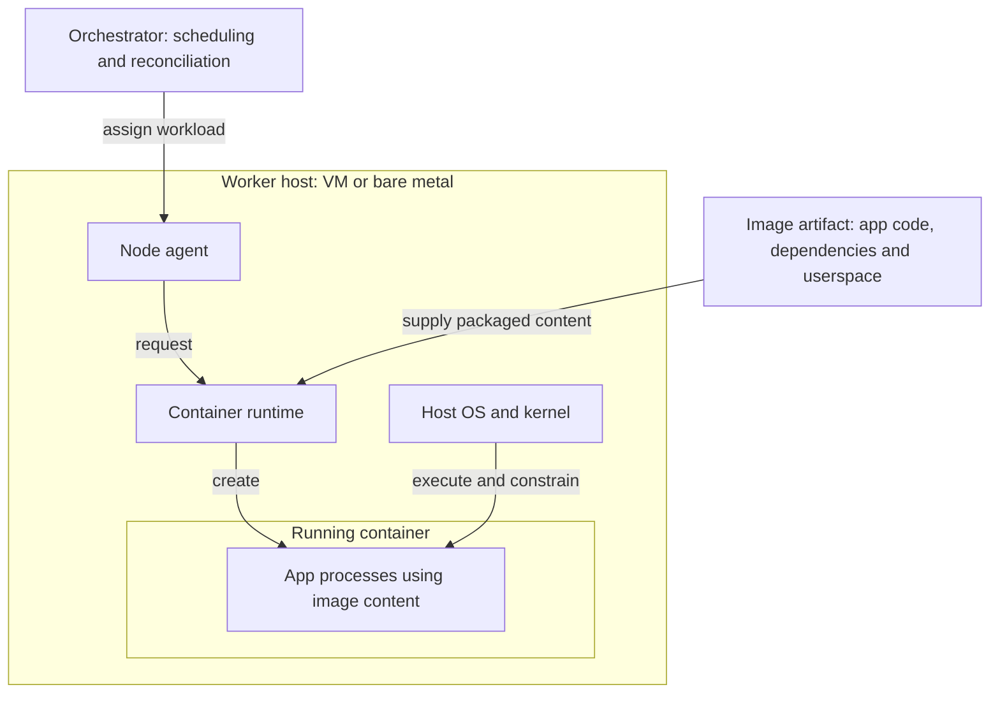
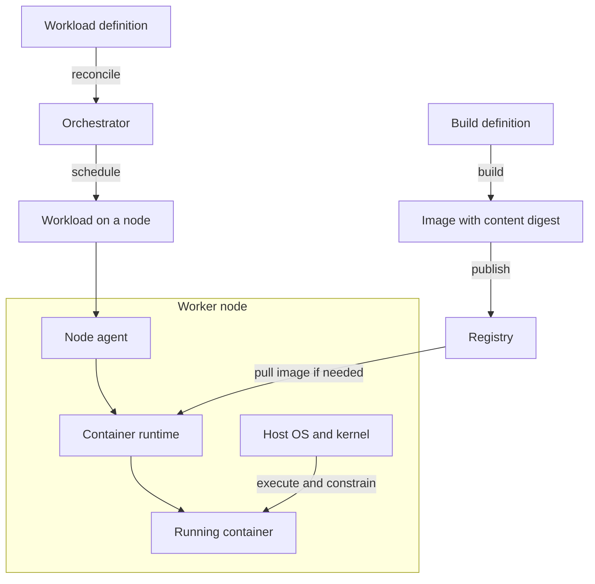
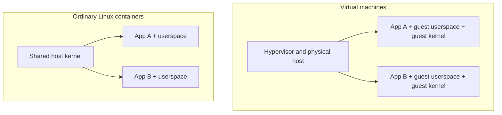
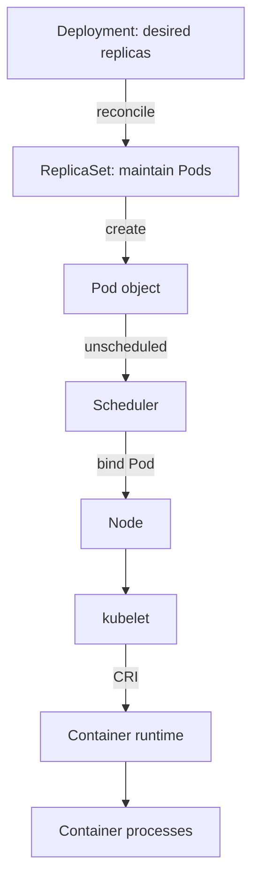
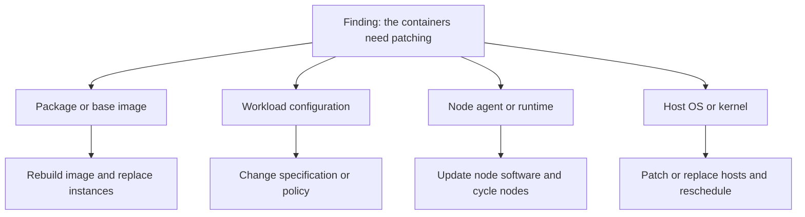

## 1. The problem with saying “container”

I have heard variations of “we need to patch the containers” in enough different contexts that I now ask what, exactly, needs patching.

The application dependencies in the image may be vulnerable. The base image may contain an outdated library. The container runtime on the worker node may require an update. The node operating system may need a security patch. Or the problem may be in the shared kernel beneath every container on that node. These are related concerns, but they require different changes, different owners and different deployment plans.

The same compression happens elsewhere. “The container has four CPUs” can mean that a Pod requests four CPU units, that a container has a CPU limit of four, that four logical CPUs are exclusively assigned, or simply that it happens to be running on a four-vCPU node. “The container is highly available” may mean there are several replicas, that traffic can reach healthy replicas, or that the application can survive losing one of them. A single running container establishes none of those things by itself.

This paper restores the boundaries underneath that shorthand. It describes a common Linux container deployment first, then calls out where particular platforms make a different choice. It is a model for reasoning and ownership, not a claim that every implementation uses precisely the same components.

### Relationship to existing work

This is not a new set of container standards. [NIST's _Application Container Security Guide_](https://csrc.nist.gov/pubs/sp/800/190/final) separates the systems that create and distribute images from orchestrators and hosts, then analyses security risks in images, registries, orchestrators, containers and host operating systems. The [Open Container Initiative (OCI)](https://opencontainers.org/) formalises three further boundaries through separate image, distribution and runtime specifications. The [CNCF _Cloud Native Security Whitepaper_](https://tag-security.cncf.io/community/resources/security-whitepaper/v2/CNCF_cloud-native-security-whitepaper-May2022-v2.pdf) places related concerns across a wider application lifecycle and runtime environment.

I use those foundations to address a narrower operational question: when somebody says “the container” in an architecture discussion or incident, do they mean a build definition, an image, a running instance, a managed workload or the host beneath it? Naming the object makes it easier to identify who owns it, what needs to change and how to tell whether the change worked.

## 2. A map of the system

The first distinction is between a _definition_, a _packaged artifact_, an _execution instance_, a _managed workload_ and the _compute host_. They answer different questions.

| Concern                     | Question it answers                                                                       | Typical example                                                              |
| --------------------------- | ----------------------------------------------------------------------------------------- | ---------------------------------------------------------------------------- |
| Build definition            | How should we produce the artifact?                                                       | Dockerfile or Containerfile, build context, build pipeline                   |
| Container image             | Which packaged files and image defaults should an instance start with?                    | OCI-compatible image identified by digest                                    |
| Registry                    | Where is the image distributed from?                                                      | Private registry or cloud registry                                           |
| Workload definition         | What should the platform keep running, with what policy and configuration?                | Kubernetes Deployment and Pod template; ECS task definition and service      |
| Orchestration control plane | Where should workloads run, and how should actual state be reconciled with desired state? | Kubernetes API, scheduler and controllers                                    |
| Workload instance           | Which scheduled unit is being managed?                                                    | Kubernetes Pod; ECS task                                                     |
| Node agent                  | What turns an assigned workload into work for this host and reports its state?            | kubelet in Kubernetes                                                        |
| Container runtime           | What obtains images and creates or manages container instances on the host?               | containerd or CRI-O in Kubernetes                                            |
| Container instance          | Which actual execution instance exists now?                                               | A running application process and its associated isolation and runtime state |
| Worker node                 | Which host supplies compute, operating system and kernel?                                 | VM or bare-metal machine registered as a node                                |
| Underlying infrastructure   | What ultimately supplies the host, network and storage?                                   | Cloud instance platform, physical server, network and volumes                |

These entries are **related objects and responsibilities, not mandatory boxes in a single vertical stack**. A registry distributes an image; it is not in the live execution path for every application request. A Deployment describes desired state while a Pod and its containers exist at runtime. A product may span several rows, and a managed service may hide some of them from its users.

Figure 1 places the packaged software, the orchestration system and the execution host in relation to one another.

_Figure 1. A cross-section of the system. The image supplies application code and userspace; the host supplies compute and the kernel; the orchestrator manages the workload. A language runtime or web server packaged in an image, when needed, is distinct from the container runtime on the host._

Figure 2 follows the two paths that meet on the worker node: building and distributing an image, and defining and scheduling a workload.

_Figure 2. The build and distribution path meets the orchestration path at the worker node. The node agent asks the runtime to obtain the image when needed; it may already be cached. The running container uses the host kernel in the ordinary Linux model. The arrows describe responsibilities, not a sequence of API calls._

An image can be stored and scanned without any container running. Multiple containers can be created from one image. A workload controller can replace one instance with another. And the host persists across many container lifetimes, although node replacement may itself be automated. OCI's [image](https://github.com/opencontainers/image-spec/blob/main/spec.md), [distribution](https://github.com/opencontainers/distribution-spec/blob/main/spec.md) and [runtime](https://github.com/opencontainers/runtime-spec/blob/main/spec.md) specifications establish the artifact, transport and execution boundaries. They do not prescribe a Dockerfile, a Kubernetes cluster or the particular teams that operate them.

## 3. From build instructions to a running process

A Dockerfile or Containerfile contains build instructions. A build interprets those instructions together with its context and other inputs to produce an image. These files are common ways to define a build, not required parts of the OCI image format. The image is a packaged artifact: filesystem content and metadata, including configuration used when a container is created. It is not a running operating system, and its contents do not necessarily include an OS distribution at all. An image that contains distribution files includes _user-space_ files; the ordinary Linux container still uses a kernel provided by the host. [Dockerfile overview](https://docs.docker.com/build/concepts/dockerfile/) · [OCI Image Specification](https://github.com/opencontainers/image-spec/blob/main/spec.md) · [NIST SP 800-190, §2.2](https://nvlpubs.nist.gov/nistpubs/SpecialPublications/NIST.SP.800-190.pdf)

An image's content can be identified by a digest; a human-friendly tag is a reference that can be moved to a different image. That distinction matters when someone asks which version is actually running. The answer requires a resolved image identity and the identity of the running workload, not just the text `app:latest` in a manifest. A content-addressed image is stable; a running container can still have a writable layer or mounted mutable data. “Immutable containers” describes an operational approach, not a guarantee produced by starting a process from an image. [Kubernetes image names and tags](https://kubernetes.io/docs/concepts/containers/images/) · [NIST SP 800-190, §2.1](https://nvlpubs.nist.gov/nistpubs/SpecialPublications/NIST.SP.800-190.pdf)

At runtime, software on a host obtains the image and creates a container instance from it. The instance has processes and a lifecycle. It may also have a writable filesystem layer, mounted volumes, environment variables, credentials, network configuration and runtime restrictions supplied when it starts. Those inputs can make two instances of the same image behave differently. The image describes part of what will run; it does not capture the whole operating environment. OCI specifies runtime configuration separately from the image and its distribution. [OCI Runtime Specification](https://github.com/opencontainers/runtime-spec/blob/main/spec.md)

This is why “patch the running container” often points at the wrong object. If a vulnerable package is baked into the image, the durable repair is generally to fix the build input, produce and verify a new image, then replace the relevant workload instances. Editing one container's filesystem in place may change that instance while leaving the declared artifact and all future replicas unchanged. If the vulnerability is in the host kernel, rebuilding the application image will not fix it. [NIST SP 800-190, §§3–4](https://nvlpubs.nist.gov/nistpubs/SpecialPublications/NIST.SP.800-190.pdf)

## 4. A container is not a small compute host

The VM mental model is useful for many infrastructure questions, but it causes trouble when carried intact into containers. A conventional VM has a guest operating system and kernel running over virtualised hardware. An ordinary Linux container consists of processes using the host's Linux kernel, with isolation and resource controls applied around them. It can present its own filesystem view, process namespace and network namespace, but those views do not amount to a separate kernel or machine. Containers and VMs are often used together: the worker node itself may be a VM. [NIST SP 800-190, §2.2](https://nvlpubs.nist.gov/nistpubs/SpecialPublications/NIST.SP.800-190.pdf)

_Figure 3. A simplified kernel boundary. A container image may contain OS user-space files without providing its own kernel. Some sandboxed runtimes add a VM or another isolation layer, so this figure describes the common Linux model rather than every runtime class._

Linux namespaces influence what processes can _see_. Control groups, or cgroups, account for and constrain resources they can _use_. Permissions, capabilities, seccomp and mandatory access controls contribute further restrictions. The actual isolation depends on configuration: processes can intentionally share some namespaces, and privileged execution, host mounts or access to host interfaces can weaken the boundary substantially. Some systems deliberately use a sandboxed runtime with an additional VM boundary when a stronger separation is needed. [Linux `namespaces(7)`](https://man7.org/linux/man-pages/man7/namespaces.7.html) · [Linux cgroup v2 documentation](https://docs.kernel.org/admin-guide/cgroup-v2.html) · [Kubernetes kernel security constraints](https://kubernetes.io/docs/concepts/security/linux-kernel-security-constraints/) · [RuntimeClass](https://kubernetes.io/docs/concepts/containers/runtime-class/)

The host has not disappeared simply because the application team cannot see it. It still has a kernel, operating system, runtime, drivers, network paths, storage, capacity and a patching lifecycle. If a node fails, a controller may create a replacement Pod that is scheduled elsewhere; the original Pod does not move between nodes. Its CPU instructions still execute somewhere. [Kubernetes nodes](https://kubernetes.io/docs/concepts/architecture/nodes/) · [Pod lifecycle](https://kubernetes.io/docs/concepts/workloads/pods/pod-lifecycle/)

### Resources are claims on a host, not a new machine

Resource language needs the same care. In Kubernetes, a CPU _request_ helps scheduling and influences resource allocation; a CPU _limit_ constrains consumption, usually by throttling. Memory requests inform scheduling, while memory limits can lead to termination when exceeded. Neither a request nor a limit generally grants ownership of named physical cores or separate memory hardware. More specialised policies, such as CPU pinning, change some of those details and should be stated explicitly. [Kubernetes resource management](https://kubernetes.io/docs/concepts/configuration/manage-resources-containers/)

So when someone says a container “has four CPUs,” the useful follow-up is: four requested CPU units, a limit of four, dedicated CPUs under a particular policy, or a node with four vCPUs? Those choices imply different performance and capacity behaviour.

## 5. What orchestration adds

A container runtime can create a container on a machine. An orchestration system manages desired workloads across machines. In Kubernetes, a Deployment can express a desired replica count and rollout strategy. Its controller manages ReplicaSets, which maintain the corresponding Pods. The scheduler assigns unscheduled Pods to nodes; kubelet on an assigned node asks a container runtime to start the Pod's containers. A Pod is a group of one or more containers that share certain resources. It is not a synonym for a single container, and a Deployment is not a Pod. [Kubernetes components](https://kubernetes.io/docs/concepts/overview/components/) · [Pods](https://kubernetes.io/docs/concepts/workloads/pods/) · [Deployments](https://kubernetes.io/docs/concepts/workloads/controllers/deployment/)

The node agent and container runtime also deserve separate names. Kubernetes uses the Container Runtime Interface (CRI) between kubelet and a compatible runtime. The scheduler does not execute application instructions; kubelet is not the container runtime; and the runtime is not the host kernel. In a managed service some of these components are operated for you, but that changes operational responsibility rather than removing the execution boundary. [Kubernetes CRI](https://kubernetes.io/docs/concepts/containers/cri/) · [Kubernetes nodes](https://kubernetes.io/docs/concepts/architecture/nodes/)

_Figure 4. Selected Kubernetes responsibilities. Controllers maintain a ReplicaSet and create Pod objects before the scheduler binds a Pod to a node; the node's kubelet then works with a runtime. This is a responsibility map, not a claim that every transition is a direct call between adjacent boxes. Networking, storage, admission and node lifecycle sit outside this view._

The system can restart or replace failed instances, coordinate rollouts and provide ways to route traffic to eligible endpoints. That does not make an application highly available by declaration. Availability also depends on enough working capacity and independent failure domains, readiness and traffic routing, state management, dependency health, and whether the application can tolerate disruption. Three replicas placed on one failing node or depending on the same broken database are not three independent paths to service. Orchestration supplies mechanisms; the architecture determines what failure those mechanisms can survive. [Kubernetes self-healing](https://kubernetes.io/docs/concepts/architecture/self-healing/) · [Disruptions](https://kubernetes.io/docs/concepts/workloads/pods/disruptions/) · [Topology spread constraints](https://kubernetes.io/docs/concepts/scheduling-eviction/topology-spread-constraints/)

Kubernetes is one implementation of these responsibilities. Other systems may use different workload units and bundle control and execution differently. Work on [Borg, Omega and Kubernetes](https://research.google/pubs/borg-omega-and-kubernetes/) shows that cluster management has its own architectural history and trade-offs beyond packaging an application as an image. The stable questions are: what declares intent, what selects capacity, what creates the process, what observes it, and what replaces it when it fails?

## 6. Apply the model to actual decisions

The value of this taxonomy is visible when a vague instruction becomes an actionable one.

| What someone says               | What must be clarified                                                                  | Likely change boundary                                                                |
| ------------------------------- | --------------------------------------------------------------------------------------- | ------------------------------------------------------------------------------------- |
| “Patch the containers.”         | Vulnerable application package, base image, runtime, node OS or kernel?                 | Rebuild and redeploy an image; update runtime; replace or patch nodes, as appropriate |
| “The image is secure.”          | Provenance and package state, or privileges and exposure when it runs?                  | Build and registry controls _and_ workload, node and cluster controls                 |
| “Give the container four CPUs.” | Request, limit, dedicated CPU assignment or node size?                                  | Workload resource specification, node policy and capacity plan                        |
| “Kubernetes keeps it up.”       | Is a process restarting, a Pod being replaced, or the service surviving a node failure? | Controller policy, replica placement, traffic routing and application design          |
| “The container has no network.” | No application listener, isolated network namespace, denied egress or missing route?    | Process configuration, Pod networking, policy or infrastructure networking            |

### Patching as a boundary test

Consider a vulnerability report against a production service. The first question is where the vulnerable component lives and which identities tell us what is deployed. An image package needs a corrected source or base image, a rebuilt artifact and a rollout. A node runtime or kernel issue calls for action on the worker fleet, often with node replacement and controlled workload disruption. A configuration problem, such as a privileged Pod, may need a workload specification or admission-policy change. Each path has a different verification step: inspect the new image digest, confirm the new instances actually run it, or confirm the affected nodes were replaced. NIST's container security guide distinguishes these risk categories, and the CNCF security whitepaper situates them across build, distribution, deployment and runtime. [NIST SP 800-190](https://csrc.nist.gov/pubs/sp/800/190/final) · [CNCF Cloud Native Security Whitepaper v2](https://tag-security.cncf.io/community/resources/security-whitepaper/v2/CNCF_cloud-native-security-whitepaper-May2022-v2.pdf)

_Figure 5. The same reported “container” problem can require four different repairs. Each path needs its own evidence of completion: a new image digest and deployed instances, an observed configuration change, or updated worker nodes._

This is also an ownership question. The application team may own image dependencies and runtime settings; a platform team may own node images, cluster upgrades and admission controls; a cloud provider may operate parts of a managed control plane. Those are common patterns, not a universal division of responsibility. The correct handoff follows the actual deployed architecture.

### Security as a set of boundaries

“Is the container secure?” cannot be answered from an image scan alone. The image has provenance and package content. The registry has access and promotion controls. The running workload has a user identity, privileges, mounts, credentials and network access. The node and kernel form a shared execution boundary for ordinary containers. The orchestrator has API permissions, admission policy and control-plane exposure. A strong control at one boundary cannot erase an unrestricted capability at another. [NIST SP 800-190, §3](https://nvlpubs.nist.gov/nistpubs/SpecialPublications/NIST.SP.800-190.pdf) · [Kubernetes security checklist](https://kubernetes.io/docs/concepts/security/security-checklist/)

The same separation improves security assessments when each control is assigned to the component it can actually assess. A host benchmark does not establish that application code is safe, and an image scan says little about a privileged container at runtime. The following are representative engineering checks and observations, not a mapping to a particular compliance framework:

| Boundary                                  | Example control or question                                                          | Evidence to inspect                                       |
| ----------------------------------------- | ------------------------------------------------------------------------------------ | --------------------------------------------------------- |
| Application and dependencies in the image | Are dependencies maintained, and was the intended source built?                      | Dependency inventory, build record and image digest       |
| Registry and distribution                 | Which artifact was accepted and made available?                                      | Access policy, artifact identity and promotion record     |
| Running workload                          | What privileges, mounts, identity and network access did this instance receive?      | Workload specification and observed runtime configuration |
| Orchestration control plane               | Who can change desired state or bypass workload policy?                              | API permissions, admission rules and audit events         |
| Worker node                               | Is the host runtime, OS and kernel within the required patch and hardening baseline? | Node inventory, versions and replacement or patch record  |

## 7. A vocabulary for incident and architecture discussions

I would use the following questions before assigning a “container issue” to a team:

1. **Which object?** Build definition, image digest, workload definition, Pod or task, container instance, runtime, node or control plane?
2. **Which identity and time?** The desired image reference, the resolved digest, a particular Pod and container ID, or a node at a particular moment?
3. **Which property?** Vulnerability, availability, resource entitlement, isolation, network reachability or operational ownership?
4. **Which authority can change it?** A build, workload rollout, policy update, runtime update, node replacement or infrastructure change?
5. **How will we prove it changed?** A new artifact, observed runtime configuration, healthy replacement instances or a patched fleet?

The distinction between definition and execution is especially important during an incident. A workload specification says what _should_ be running. A Pod or task and its container IDs tell us what _was_ created. A node record tells us where it ran. The observed outcome can diverge from all of the intentions above. That is why useful evidence needs both the desired configuration and the runtime identities.

Build provenance can help establish how an image was produced; it does not, by itself, establish which instance ran on which node or whether the service remained healthy. Conversely, a healthy Pod does not prove that its image was built from trusted inputs. Those are different kinds of evidence for different claims. [SLSA provenance specification](https://slsa.dev/spec/v1.2/provenance/) · [NIST IR 8176: Security Assurance Requirements for Linux Application Container Deployments](https://csrc.nist.gov/pubs/ir/8176/final)

## 8. Conclusion

The word “container” is doing too much work. The image is an artifact; a container is an execution instance; a Pod or task is a managed workload unit; an orchestrator coordinates desired state; and a worker node supplies the operating system, kernel and compute on which execution ultimately happens. Real products blur some of these boundaries, but the underlying questions remain distinct.

Once the object is named, the engineering conversation improves. We can identify what failed, who can change it, which other layers depend on it and what evidence would show the repair worked. That is the point of the model: fewer arguments about labels, and better decisions about the system behind them.

---

### Selected references

The taxonomy in this paper is a working synthesis rather than an industry standard. The following works establish its prior art and support the implementation-specific claims in the text. Living documentation is linked to its maintained page rather than a particular release snapshot.

1. Murugiah Souppaya, John Morello and Karen Scarfone. [_Application Container Security Guide_](https://csrc.nist.gov/pubs/sp/800/190/final). NIST SP 800-190, September 2017. In particular, §§2.2–2.3 on architecture and §3 on component risks. Its architecture is durable; some named products and examples are dated.
2. CNCF TAG Security. [_Cloud Native Security Whitepaper_, version 2](https://tag-security.cncf.io/community/resources/security-whitepaper/v2/CNCF_cloud-native-security-whitepaper-May2022-v2.pdf), May 2022. A broader lifecycle and security model.
3. Open Container Initiative. [Image Specification](https://github.com/opencontainers/image-spec/blob/main/spec.md), [Distribution Specification](https://github.com/opencontainers/distribution-spec/blob/main/spec.md), and [Runtime Specification](https://github.com/opencontainers/runtime-spec/blob/main/spec.md). Separate standards for packaged content, its distribution and container execution.
4. Linux man-pages project. [`namespaces(7)`](https://man7.org/linux/man-pages/man7/namespaces.7.html). Linux namespace semantics and the resources they scope.
5. Linux kernel documentation. [_Control Group v2_](https://docs.kernel.org/admin-guide/cgroup-v2.html). Resource control interfaces and behaviour.
6. Kubernetes project. [Components](https://kubernetes.io/docs/concepts/overview/components/), [Controllers](https://kubernetes.io/docs/concepts/architecture/controller/), [Container Runtime Interface](https://kubernetes.io/docs/concepts/containers/cri/), [Pods](https://kubernetes.io/docs/concepts/workloads/pods/) and [Nodes](https://kubernetes.io/docs/concepts/architecture/nodes/). The example implementation of orchestration, scheduling and node execution.
7. Kubernetes project. [Images](https://kubernetes.io/docs/concepts/containers/images/), [Resource Management for Pods and Containers](https://kubernetes.io/docs/concepts/configuration/manage-resources-containers/), and [Linux Kernel Security Constraints](https://kubernetes.io/docs/concepts/security/linux-kernel-security-constraints/). Image identity, resource controls and security boundaries.
8. Kubernetes project. [Self-Healing](https://kubernetes.io/docs/concepts/architecture/self-healing/), [Disruptions](https://kubernetes.io/docs/concepts/workloads/pods/disruptions/) and [Pod Topology Spread Constraints](https://kubernetes.io/docs/concepts/scheduling-eviction/topology-spread-constraints/). Mechanisms relevant to, but not sufficient for, service availability.
9. Brendan Burns, Brian Grant, David Oppenheimer, Eric Brewer and John Wilkes. [_Borg, Omega, and Kubernetes_](https://research.google/pubs/borg-omega-and-kubernetes/). _ACM Queue_ 14, 2016. Historical context for container management systems.
10. SLSA. [Provenance specification, version 1.2](https://slsa.dev/spec/v1.2/provenance/). The build-side evidence boundary; it is not a statement about runtime health.
11. Ramaswamy Chandramouli. [_Security Assurance Requirements for Linux Application Container Deployments_](https://csrc.nist.gov/pubs/ir/8176/final). NIST IR 8176, October 2017. Further reading on establishing what security controls actually assure.

## Suggested citation

Murphy, Damien. _Unpacking the Container Stack: A Working Model for Images, Running Containers, Orchestration and Hosts_. Version 1.0, 24 September 2026.
