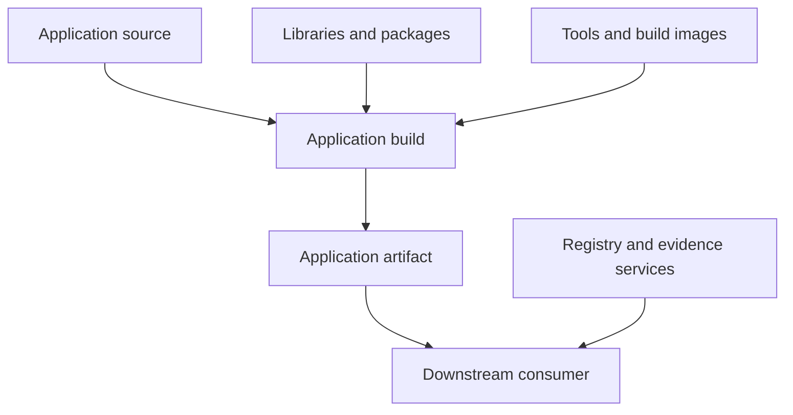
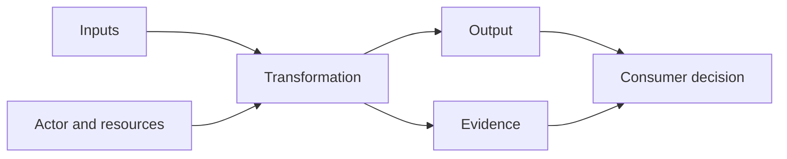
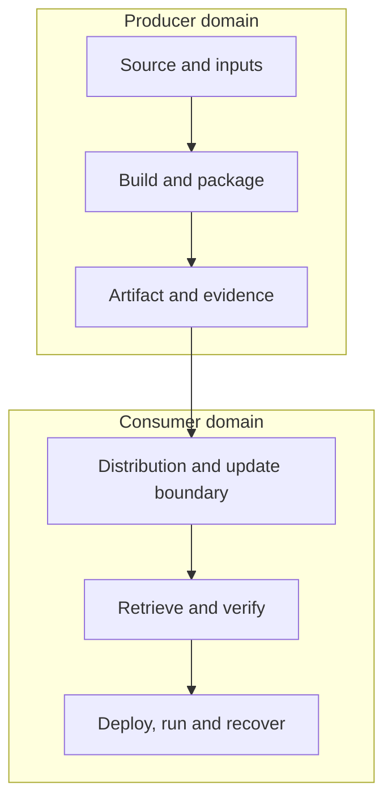
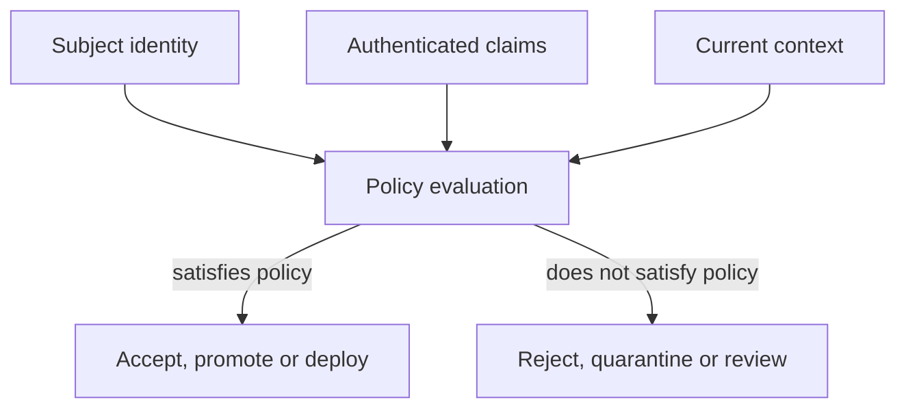

## 1. The problem with saying “software supply chain”

“Software supply chain” has become a container for several related problems.

One person uses it to mean open-source dependencies. Another means the CI/CD system. A security programme may use it to group source controls, build hardening, artifact signing and software bills of materials. A procurement team may use it to describe third-party suppliers. A platform team may mean the route from a repository to a production cluster.

All of these concerns belong in the discussion, but they are not interchangeable. A dependency scanner cannot establish that an artifact came from an approved build. A signature does not reveal what is inside the signed object. A secure producer cannot force a consumer to verify its evidence. A hardened build says little about the configuration or health of the system in which the artifact eventually runs.

The ambiguity matters because controls act on particular boundaries. When those boundaries are collapsed into one phrase, organisations buy tools, generate metadata and declare success without being clear about the claim any of them can support.

A useful opening question is:

> **Which trust boundary in the software supply chain are we trying to understand or control?**

That question needs a broader model than a pipeline diagram.

### A working definition

In this paper, a **software supply chain** is:

> **The socio-technical system through which software, its inputs, authority and evidence about it are produced, transformed, distributed, evaluated, operated, updated and recovered across technical and organisational boundaries.**

This definition deliberately includes more than build and delivery automation. The system may contain:

- source repositories and change controls;
- direct and transitive dependencies;
- compilers, package managers, build plugins and build images;
- workflow definitions, automation services and execution environments;
- identities, credentials, signing authorities and trust roots;
- artifact repositories, package registries, mirrors and release channels;
- deployment and update mechanisms;
- evidence stores, transparency services and policy engines;
- the people and organisations that own, operate or influence them.

The definition also includes evidence. Once producer and consumer are separated, the consumer was not present when the software was built. It needs a way to evaluate claims about events it did not observe.

### Scope, contribution and prior work

This paper is an explanatory synthesis, not a new supply-chain standard. It does not claim that the field lacks formal models.

The [in-toto](https://in-toto.io/) model describes authorised functionaries performing expected steps on materials to produce products, with signed link metadata providing evidence. [SLSA](https://slsa.dev/spec/v1.2/) defines requirements and evidence for source and build assurance. [The Update Framework](https://theupdateframework.io/) addresses secure distribution under partial compromise. Academic systematisations describe supply chains in terms of actors, artifacts, operations, resources, relationships and security properties. NIST, CISA, NSA, CNCF and OpenSSF provide development, acquisition, consumption and operational guidance.

The contribution here is to connect those bodies of work in one practitioner-facing model. It supplies a shared vocabulary for asking:

1. What is the exact subject?
2. Who controls or influences the transformation?
3. What changed, and through which relationship?
4. What claim is being made?
5. What evidence supports that claim?
6. Which consumer decides whether to accept it?
7. How can the decision be reversed and the system recovered?

The aim is not to replace the underlying standards. It is to make their different responsibilities easier to see.

### How to read this paper

The model is shared; different roles can enter it from different points:

| Reader | Most relevant sections |
| --- | --- |
| Developer or maintainer | Dependencies, names and versions, build trust, practical source and intake controls |
| Platform or build engineer | CI/CD boundaries, transformations, toolchain and build integrity, evidence generation |
| Security engineer | Attack terminology, evidence semantics, policy, threat boundaries and recovery |
| Architect or engineering leader | Network topology, governance roles, framework crosswalk and lifecycle baseline |
| Acquirer or supplier manager | Producer–consumer responsibilities, SBOM/VEX, distribution, update and disclosure |
| Operator or SRE | Admission decisions, deployed identity, update freshness, runtime change and recovery |

The paper is cumulative, but no reader needs to become an expert in every specification to use the model. The recurring task is to identify the subject, authority, evidence, decision and recovery path at the boundary they own.

### Security is one property of the system

The supply chain exists whether it is secure or not. It is a production and distribution system before it is a security programme.

Different stakeholders care about different properties of that system:

| Property | Representative question |
| --- | --- |
| Integrity | Is this the intended software, produced without unauthorised change? |
| Availability | Can required inputs, build capacity and distribution channels be reached when needed? |
| Freshness | Is this still the currently authorised software and evidence? |
| Reproducibility | Can the same declared inputs independently produce the same output? |
| Traceability | Can an artifact be connected to its source, build, release and consumers? |
| Maintainability | Can a compromised or obsolete input be located and replaced safely? |
| Recoverability | Can trust, keys, metadata and software be repaired after compromise? |
| Compliance | Can licensing, policy and regulatory obligations be demonstrated? |
| Operability | Can failures, ownership and recovery paths be understood across boundaries? |
| Efficiency | Does the system deliver evidence and control without making the safe path unusable? |

A dependency repository outage is a supply-chain failure even when no attacker is involved. So is an irreproducible release that cannot be rebuilt, an abandoned component that cannot be patched, or evidence that is generated but cannot follow an artifact through a mirror.

Security receives particular attention because compromise can exploit the same connectivity and reuse that make the system productive. The underlying engineering problem is broader: make the system's inputs, transformations, authority, ownership and outputs understandable enough to control and recover.

## 2. A chain is one projection of a dependency network

The simplest supply-chain picture is linear:

```text
source → build → package → store → distribute → deploy → run
```

It is a helpful lifecycle projection. It shows that software changes form and ownership as it moves. It also hides most of the system.

An application may incorporate hundreds of libraries, a language runtime, operating-system packages and a container base image. Its build may invoke third-party actions, plugins, compilers and remote services. Each input was produced through a supply chain of its own. The application may then be mirrored, repackaged or embedded in another product before it reaches the organisation that runs it.

Modern software is therefore less something built from first principles than something assembled from existing components and services. Its supply chain is a **directed dependency network** whose nodes can be both consumers and producers.



*Figure 1. The familiar source-to-artifact path is one route through a wider dependency network.*

Research on package ecosystems has shown why this topology matters. A small number of packages or maintainer accounts can influence large portions of an ecosystem. Transitive dependencies create reach that neither the application author nor the end user directly chose. The graph is not only technical: authority over namespaces, release credentials and maintenance decisions is part of its structure.

This produces several consequences:

1. **A local control has non-local dependencies.** A policy may verify a signature while depending on an identity provider, certificate authority, transparency service and local trust configuration.
2. **A small component can have a large blast radius.** Importance is not proportional to code size.
3. **An organisation can change roles repeatedly.** It consumes a base image, produces an application image, distributes it internally and becomes an upstream supplier to another team.
4. **There is no single authoritative diagram.** A build graph, dependency graph, supplier map, evidence graph and deployment inventory show different relationships.
5. **Change is the important event.** Security depends not only on what exists, but on who can change it, how that change propagates and where it is evaluated.

The word *chain* remains useful because it communicates propagation and downstream consequence. The mistake is treating the chain as the system's literal topology.

## 3. The software supply chain is not the CI/CD pipeline

CI/CD is a set of practices and automation for integrating, validating and delivering change. A pipeline is one implementation mechanism. The software supply chain is the wider system of inputs, transformations, actors, evidence, distribution paths and decisions in which that mechanism operates.

[NIST SP 800-204D](https://csrc.nist.gov/pubs/sp/800/204/d/final) describes CI/CD pipelines as flow processes through which operations constituting part of the software supply chain occur. The [CNCF Secure Software Factory](https://tag-security.cncf.io/community/resources/security-whitepaper/v1/secure-software-factory/) similarly focuses on the interfaces and controls through which a software factory produces verifiable artifacts. Neither makes the pipeline synonymous with the complete supply chain.

| Concern | CI/CD view | Supply-chain view |
| --- | --- | --- |
| Primary focus | Integrate, test and deliver change | Establish and preserve trust across production, distribution and consumption |
| Typical boundary | Repository to deployment environment | Upstream producer to downstream operator, including external services and suppliers |
| Inputs | Source, configuration, tests | Source, dependencies, tools, services, identities, policies and metadata |
| Outputs | Build or deployment result | Artifacts, evidence, decisions, deployed instances and update state |
| Failure question | Why did the workflow fail? | Which relationship or trust boundary failed, and who can recover it? |
| Security question | Is automation protected? | Are software and claims acceptable across every relevant transition? |

The distinction matters operationally.

A package can enter a developer workstation without traversing a central pipeline. A compromised IDE extension can alter source before CI begins. A signed artifact can be replaced in a mirror after the build ends. A runtime can load a plugin or model long after deployment. A supplier can publish evidence that the consumer never retrieves. All are supply-chain concerns, but none can be understood by inspecting pipeline stages alone.

Securing CI/CD is therefore necessary in many systems. It is not a complete software supply-chain strategy.

## 4. A working model: subjects, actors, resources, transformations and evidence

A practical model needs enough structure to distinguish concerns without becoming another standard.

### The elements

| Element | Meaning | Examples |
| --- | --- | --- |
| Subject | The exact object about which a claim or decision is made | Commit, source revision, package, image manifest, binary, deployment |
| Actor | A person, service or organisation able to act | Maintainer, reviewer, build service, registry, verifier, operator |
| Resource | A system or capability used by an actor or transformation | Repository, runner, compiler, identity provider, signing service |
| Input | A subject consumed by a transformation | Source, dependency, base image, configuration, workflow definition |
| Transformation | An operation that can create or change a subject | Review, resolve, compile, package, sign, mirror, deploy, update |
| Output | A subject produced by a transformation | Revision, binary, image, release, deployed instance |
| Relationship | The dependency or authority connecting elements | Imports, built-by, signed-by, distributed-by, approved-by, deployed-as |
| Evidence | Recorded information supporting a bounded claim | Provenance, signature, SBOM, VEX, test result, transparency receipt |
| Policy | An expectation applied at a decision boundary | Approved builder, required review, permitted supplier, freshness limit |
| Decision | A consequential evaluation of subject, evidence and policy | Accept, reject, quarantine, promote, deploy, revoke |

This model draws directly from established work. in-toto uses materials, products, steps and functionaries. Defence-oriented research models artifacts, steps, resources and principals or actors. The vocabulary here changes the presentation, not the underlying insight: security depends on the relationships among technical objects, operations and authorities.

### The recurring unit

Most supply-chain activity can be reduced to the following unit:



*Figure 2. A transformation creates an output and evidence. A consumer evaluates both under its own policy.*

Examples include:

- a source-control system accepting a reviewed change and producing a revision;
- a package manager resolving names and version constraints into concrete packages;
- a build service converting source, dependencies and configuration into a binary;
- a registry accepting an authenticated publication into a namespace;
- a mirror copying an artifact and its metadata into another trust domain;
- a deployment controller instantiating an approved digest under a configuration;
- an updater selecting and applying a new authorised release.

For each transformation, ask:

1. Are the inputs complete, immutable and identified?
2. Who or what is authorised to perform the operation?
3. Which resources can influence the result?
4. Can undeclared inputs enter?
5. Is the output uniquely identifiable?
6. What evidence is created, by whom and from which observation point?
7. Which later consumer will use that evidence?
8. How can the output or authority be revoked?

### Trust follows control

The component able to change an output, choose an input, issue evidence or override a decision belongs in the trust model.

This includes obvious authorities such as maintainers and signing services. It also includes less visible ones: repository administrators, CI control planes, build-image publishers, package-registry operators, identity providers, policy administrators and emergency-access paths.

The most consequential boundary is often not where bytes move. It is where authority to influence them changes.

### Two interacting planes

The system has at least two planes:

| Plane | Contains | Core question |
| --- | --- | --- |
| Technical | Artifacts, transformations, identities, evidence, distribution and enforcement | What can the system establish or prevent? |
| Governance | Ownership, requirements, supplier commitments, risk acceptance, disclosure, end of life and recovery authority | Who is accountable for deciding and responding? |

A technically valid control can fail organisationally. An SBOM may be accurate but have no owner who can act on it. A deployment policy may reject an urgent patch without a safe exception process. A supplier may provide provenance but no commitment to disclose a signing-key compromise.

Every important boundary therefore needs both a technical enforcement point and an accountable decision owner.

## 5. Failure, exposure and attack are different concepts

The phrase “supply-chain attack” is often applied to every problem involving upstream software. That makes incident communication less precise and threat modelling less useful.

| Term | Meaning |
| --- | --- |
| Supply-chain dependency | A technical or organisational relationship through which software, services, authority or evidence is obtained |
| Supply-chain weakness | A condition that can fail or be exploited, whether introduced accidentally or maliciously |
| Supply-chain failure | Loss of a required property such as availability, integrity, freshness, maintainability or traceability |
| Supply-chain exposure | Downstream dependence on an upstream weakness, event or authority |
| Supply-chain attack | Intentional compromise or manipulation of an upstream actor, operation or artifact that is propagated toward downstream targets |

A vulnerable dependency creates exposure. An abandoned package creates maintainability risk. A registry outage creates an availability failure. Those events occur in the supply chain, but they are not necessarily supply-chain attacks.

The systematisation by [Okafor et al.](https://arxiv.org/abs/2406.10109) describes a characteristic attack sequence:

1. **Compromise.** The attacker gains influence over an actor, operation, resource or artifact.
2. **Alteration.** That influence is used to change part of the supply chain.
3. **Propagation.** The altered object or behaviour moves through a trusted downstream relationship.
4. **Exploitation.** The attacker uses the propagated change against a downstream target.

The sequence explains what is distinctive about the attack class. The adversary does not merely exploit software that happens to have dependencies. It manipulates the upstream production or distribution relationship and uses ordinary trust or automation as the delivery mechanism.

This distinction does not reduce the importance of non-malicious failures. It prevents one label from hiding different causes, owners and controls.

## 6. Dependency is not provenance

A dependency describes a composition or service relationship. Provenance describes the history of how a particular subject came to exist.

These answer different questions:

| Question | Dependency information | Provenance information |
| --- | --- | --- |
| What components are included or required? | Yes | Sometimes, if recorded as materials |
| Which exact artifact was produced? | Not necessarily | Yes, through subject identity |
| Which process created it? | No | Yes |
| Which builder executed the process? | No | Yes, if recorded and authenticated |
| Is a component vulnerable? | Not by itself | Not by itself |
| Was the intended dependency selected? | Partly, with resolved identity | Partly, if resolution is recorded |

An application can have an accurate dependency inventory and no trustworthy build provenance. It can also have strong provenance describing a build that intentionally consumed a vulnerable or malicious dependency.

### Dependencies take several forms

The obvious dependencies are runtime libraries. The full set is wider:

- source libraries and packages;
- container base images and operating-system packages;
- compilers, linkers and code generators;
- build plugins, workflow actions and reusable pipeline definitions;
- hosted build, signing and scanning services;
- package indexes, registries, mirrors and name-resolution rules;
- identity providers, certificate authorities and transparency services;
- dynamically loaded plugins, models, scripts and rule sets;
- human maintainers and the governance of the projects they control.

Some dependencies become part of the output. Others influence it without appearing in the output. Some are services rather than downloadable artifacts. An SBOM that lists shipped components will not normally describe every tool, service and authority able to affect the build.

### A dependency is also a maintenance relationship

Package-ecosystem research shows that dependency risk is not explained by code alone. The [npm ecosystem study](https://www.usenix.org/conference/usenixsecurity19/presentation/zimmerman) found substantial influence concentrated in a small number of packages and maintainer accounts. The [Backstabber's Knife Collection](https://pmc.ncbi.nlm.nih.gov/articles/PMC7338168/) documented malicious packages across npm, PyPI and RubyGems. [MalOSS](https://doi.org/10.14722/ndss.2021.23055) demonstrated malicious-package discovery at registry scale. Research into [package confusion](https://www.usenix.org/conference/usenixsecurity23/presentation/neupane) shows that names, namespaces and developer expectations are themselves attack surfaces.

Consuming a dependency means relying on some combination of:

- a maintainer's account security and judgement;
- project ownership and succession;
- a registry's namespace and publication controls;
- a release and disclosure process;
- the ability to patch or replace the component;
- enough maintenance capacity to respond before consumer exposure becomes unacceptable.

Consumers cannot inherit control over those conditions merely by depending on the project. They can reduce dependencies, constrain versions and sources, mirror critical inputs, rebuild from source, sandbox behaviour, monitor changes, contribute resources, or replace the component. Each choice changes cost and ownership; none removes the relationship.

## 7. Names, identities, versions and channels

Names are convenient selectors. They are not necessarily stable identities.

`latest`, `main`, `stable`, a package version, an OCI tag and a release-channel name can all resolve to different content over time. Their mutability may be intentional: a channel exists to move consumers forward. The security problem appears when a mutable selector is treated as evidence of immutable identity.

### Human-readable name and content identity

| Identifier | Useful for | Limitation |
| --- | --- | --- |
| Package or repository name | Discovery and ownership | Namespace can be transferred, confused or compromised |
| Semantic version | Compatibility and release communication | Meaning depends on publisher and registry policy |
| Branch or tag | Selecting a source revision | May be mutable unless protected |
| Release channel | Controlled progression | Intentionally changes over time |
| Digest | Identifying exact bytes or a content-addressed object | Says nothing about origin, authority or safety |

The durable pattern is to separate selection from verification:

1. use a name, version constraint or channel to discover a candidate;
2. resolve it to an immutable subject identity;
3. preserve that identity through later transformations;
4. verify evidence and policy against that exact subject;
5. record the identity used in the decision.

Pinning helps by constraining selection. It does not establish that the pinned object is benign, maintained or correctly produced.

### Build once, promote the same artifact

Rebuilding separately for development, test and production creates separate outputs, even if the same source reference is used. Environmental differences, dependency resolution, timestamps and mutable inputs can change the result.

The stronger pattern is:

> **Build once, identify the result immutably, evaluate it, and promote that same subject.**

Promotion becomes a decision about an existing artifact rather than another production event. If a rebuild is unavoidable, it is a new artifact and needs its own provenance and evaluation.

### Version is not freshness

A higher-looking version does not by itself establish that an update is current or authorised. Attackers can replay older signed metadata, freeze a client on a vulnerable release, create inconsistent repository views or abuse compromised signing authority.

Freshness depends on trusted metadata, version and expiry rules, the consumer's local state and an update protocol designed to survive partial compromise. This becomes important in Section 11.

## 8. The build is a privileged transformation boundary

The build converts human-readable intent and many external inputs into the object consumers will trust. It is an attractive point of compromise because it can alter every produced artifact while leaving reviewed source unchanged.

Relevant threats include:

- malicious or compromised build steps;
- a poisoned compiler, linker or code generator;
- mutable or unverified dependencies;
- compromised build images or persistent runner state;
- credential theft from the execution environment;
- an attacker changing a workflow definition;
- a build service or administrator altering execution or evidence;
- undeclared network inputs changing the result;
- provenance generated outside the trusted observation boundary.

Ephemeral execution reduces unwanted state carried between jobs, but ephemeral does not mean trusted. A newly created environment can still start from a compromised image, receive excessive credentials or execute attacker-controlled code. Isolation, identity, declared inputs and evidence generation address different properties.

### From Trusting Trust to verifiable builds

Ken Thompson's [“Reflections on Trusting Trust”](https://doi.org/10.1145/358198.358210) established the uncomfortable result: complete source review cannot prove that a compiler-produced binary corresponds to that source when the compiler or its lineage is compromised.

[Diverse double-compiling](https://arxiv.org/abs/1004.5548) provides a practical technique for detecting that class of attack under explicit assumptions. [Reproducible Builds](https://reproducible-builds.org/docs/definition/) aims to make a binary independently derivable from a specified source and build environment. in-toto and SLSA add authenticated evidence about steps, inputs and producing platforms.

These mechanisms complement rather than replace one another:

- provenance records how a particular build occurred;
- hermeticity constrains undeclared influence;
- reproducibility enables independent comparison;
- diverse double-compiling addresses a specific compiler-correspondence threat;
- toolchain bootstrapping asks where trust in the compiler and build environment begins;
- consumer verification determines whether the resulting claims are sufficient.

### Reproducibility, hermeticity and provenance

**Reproducibility** asks whether independent builds from the same declared inputs produce bit-for-bit identical outputs.

**Hermeticity** asks whether the build is isolated from undeclared inputs such as mutable network resources or ambient host state.

**Provenance** records verifiable information about where, when and how a particular subject was produced.

A build can emit provenance yet depend on the current time, an unpinned repository or another undeclared input. A reproducible result can be produced without retaining authenticated provenance for the artifact a consumer received. A hermetic build can reliably reproduce the wrong source. A toolchain can be fully declared and still malicious.

The practical question is not which single property solves the build. It is which combination of controlled inputs, isolation, authenticated identity, toolchain lineage, provenance and independent verification provides sufficient confidence for the consumer's risk.

## 9. The evidence stack

Digest, signature, provenance, attestation, transparency and SBOM are often discussed together because they travel through the same systems. They occupy different logical layers.

| Layer | Primary question | Examples | What it does not establish by itself |
| --- | --- | --- | --- |
| Subject identity | Exactly what object or revision is this about? | Digest, immutable source revision, package URL | Origin, approval or safety |
| Predicate or claim | What is asserted about the subject? | Provenance, SBOM, test result, VEX status | Authentication or truth |
| Statement binding | How is the subject bound to the claim type? | in-toto Statement | Who made the claim |
| Envelope authentication | Was this payload signed under an accepted key or certificate? | DSSE, COSE, Sigstore bundle | Semantic authority or factual accuracy |
| Transparency or receipt | Was the signed statement registered in an auditable history? | Rekor entry, SCITT receipt | That the claim is true or acceptable |
| Policy decision | Does the evidence satisfy expectations here and now? | in-toto verification, SLSA verifier, admission policy | Future safety or runtime correctness |
| Decision record | What was accepted under which policy and exception? | VSA, admission record, audit record | That conditions will never change |

### Digests identify content

A cryptographic digest allows a consumer to test whether bytes are identical to expected bytes. It is the foundation for binding evidence to a subject and for preserving identity across promotion.

A digest says nothing about who produced the bytes, whether they were authorised, or whether they are safe.

### Signatures authenticate a cryptographic commitment

A digital signature authenticates a cryptographic operation over content under a key. Connecting that key operation to a person, workload, organisation or authorised role requires more:

- a certificate, key registry or identity-provider claim;
- confidence in key custody or workload identity;
- a trust root and validation rules;
- a policy explaining why that identity is authorised for this subject and claim;
- a time and revocation model.

The useful question is not simply “is it signed?” It is:

> **Does this signature verify over the expected object, under an identity authorised to make this particular commitment, at a time and under a trust policy the consumer accepts?**

A compromised or over-authorised signer can make a valid signature over the wrong object. Signing is evidence of commitment, not proof of benign content or secure production.

### Attestations have layers

The [in-toto Attestation Framework](https://github.com/in-toto/attestation/tree/main/spec) separates four layers:

1. **Predicate.** Type-specific metadata containing the claim.
2. **Statement.** A binding between one or more subjects and the predicate type.
3. **Envelope.** Authentication and serialisation of the statement.
4. **Bundle.** A grouping of multiple attestations.

[DSSE](https://github.com/secure-systems-lab/dsse) is the recommended envelope format. It authenticates the payload and payload type, reducing confusion between differently interpreted messages.

This separation matters. A provenance predicate and an SBOM predicate can use the same statement and envelope machinery while making different claims. A verifier can validate an envelope without accepting the predicate issuer as authoritative. An attestation can be authentic and factually wrong.

Evaluate an attestation across at least six dimensions:

| Dimension | Question |
| --- | --- |
| Authenticity | Was the statement signed under the expected cryptographic identity? |
| Authority | Is that identity permitted to make this type of claim? |
| Accuracy | Does the claim reflect what actually occurred? |
| Completeness | Does it omit material facts needed by the consumer? |
| Freshness | Is it still current, unrevoked and relevant? |
| Applicability | Does it concern the exact subject and decision context? |

### Provenance is one kind of claim

Provenance describes where and how a subject came to exist. [SLSA v1.2](https://slsa.dev/spec/v1.2/) has active Source and Build tracks, reflecting that source-revision assurance and artifact-production assurance are related but different.

The distinction between **having provenance** and **having trustworthy provenance** is essential. Metadata may merely exist. Stronger assurance depends on how the producing platform controls the event, protects evidence generation and enables consumer verification.

### Transparency creates accountability, not truth

Sigstore's Rekor provides an append-only transparency log for signatures and supply-chain metadata. [SCITT, standardised in RFC 9943](https://www.rfc-editor.org/rfc/rfc9943.html), defines an architecture for registering signed statements with transparency services and issuing receipts.

These mechanisms improve discoverability, auditability and accountability. They can make equivocation or unexpected signing visible under the system's threat model. They do not make an inaccurate statement accurate. Transparency answers whether a statement was recorded and can be audited, not whether its predicate is acceptable.

## 10. Producer and consumer are super-roles

Many diagrams assume that the organisation building software will also deploy and run it. That is one arrangement, not the general model.



*Figure 3. The producer controls production and the claims it emits. The consumer controls acceptance, deployment and operation.*

The producer is responsible for making supportable claims about what it produced. The consumer is responsible for deciding whether those claims, the producer and the subject satisfy its needs.

Those are super-roles containing more specific authorities:

| Role | Typical authority or obligation |
| --- | --- |
| Maintainer or developer | Changes source or an upstream component |
| Integrator or product producer | Selects inputs and creates a product artifact |
| Build-platform operator or functionary | Executes a transformation and emits evidence |
| Registry or distributor | Controls namespace, publication and delivery |
| Evidence issuer or assessor | Makes a bounded claim about a subject |
| Supplier or vendor | Packages product, support and disclosure commitments |
| Acquirer or consumer | Defines acceptance requirements and obtains the product |
| Verifier or policy operator | Interprets evidence and records a decision |
| Deployer or runtime operator | Instantiates, configures, observes, updates and recovers the system |
| Downstream producer | Incorporates the subject and assumes new producer duties |

The [NSA/CISA/ODNI guidance series](https://www.nsa.gov/Press-Room/News-Highlights/Article/Article/3146465/nsa-cisa-odni-release-software-supply-chain-guidance-for-developers/) separates developers, suppliers and customers. The [OpenSSF S2C2F](https://github.com/ossf/s2c2f) focuses on secure consumption. [CNCF's best-practices paper](https://tag-security.cncf.io/community/working-groups/supply-chain-security/supply-chain-security-paper-v2/) uses personas to guide different stakeholders. The recurring lesson is that responsibility is distributed.

An organisation can hold several roles. A team can consume an open-source library, build it into an internal package, publish that package to a registry and operate a service that consumes it. The roles still matter because different systems, identities and policies govern each transition.

### Producer and consumer responsibilities

| Producer-side responsibility | Consumer-side responsibility |
| --- | --- |
| Protect source and the build process | Define acceptable sources, builders, suppliers and identities |
| Control and record resolved inputs | Evaluate dependency, maintenance and supplier risk |
| Publish immutable, uniquely identifiable artifacts | Retrieve and retain artifacts by immutable identity |
| Generate accurate provenance and composition evidence | Validate, interpret and use supplied metadata |
| Authenticate artifacts and claims with bounded identities | Verify identity, authority, subject and freshness |
| Publish through controlled channels | Control mirrors, promotion, deployment and updates |
| Disclose defects, compromise and end-of-life state | Monitor exposure and apply, defer or reject updates |
| Provide recovery and revocation information | Locate affected use and execute recovery decisions |

A secure producer is of limited value if a consumer downloads by mutable name and performs no verification. A careful consumer cannot reconstruct strong provenance that a producer never generated. Assurance is composed across both sides of the boundary.

### Evidence must survive distribution

Software and evidence can take different routes. An artifact may be copied to another registry while an SBOM remains in a vendor portal. A signature may be attached to one manifest but lost when an image is rebuilt. A package may be repacked by a distribution. A consumer may scan a retrieved object and create a new attestation under its own identity.

The question is not merely whether evidence existed at publication. It is whether the consumer can bind the received subject to the relevant evidence and distinguish producer claims from claims added later by distributors or itself.

OCI specifications provide content-addressed distribution and mechanisms for associating related objects such as signatures, attestations and SBOMs. This is transport and association machinery. It does not decide which issuer, claim or policy a consumer should trust.

## 11. Distribution, update and recovery preserve trust over time

Publication does not freeze trust in time. A consumer must decide not only whether an artifact was authentic when released, but whether it is still an authorised version, whether fresher metadata exists, whether a signing authority has been revoked, and how to recover if a repository or key is compromised.

Secure update is therefore a sequence of decisions, not just a protected download.

### Why a valid signature is insufficient

An attacker who cannot forge a signature may still be able to:

- replay an older, correctly signed release;
- freeze a client on stale metadata;
- present an inconsistent combination of repository metadata and artifacts;
- exploit one compromised online signing key;
- prevent access to newer security updates;
- serve different views to different consumers;
- keep consumers using software after its authority or support has expired.

The [TUF](https://theupdateframework.io/docs/overview/) design treats these as protocol and trust-management problems. Its principles include distinct metadata roles, delegated authority, threshold signatures, explicit versions and expiry, trusted local state and mechanisms for rotating or revoking trust after compromise.

[Uptane](https://uptane.org/docs/latest/standard/uptane-standard) adapts secure-update principles to ground vehicles, where partial compromise, constrained clients and recovery have safety consequences. The domain is specialised; the transferable lesson is broad: design for compromised keys and repositories, not only for the happy path in which every signer remains trustworthy.

### Questions for an update boundary

1. How is the initial trust root installed and changed?
2. Which roles can authorise targets, repository state and freshness?
3. Can one online key unilaterally publish malicious software?
4. How does the client detect rollback, freeze and inconsistent metadata?
5. What happens when a mirror, registry, identity provider or transparency service is unavailable?
6. How are keys, identities, statements and artifacts revoked?
7. Can the system recover if both software and trust metadata must change?
8. Is update failure observable, or does the client silently remain vulnerable?
9. Can every affected deployment be located and replaced?
10. Who has authority to declare an emergency exception or end of life?

### Recovery is part of assurance

A supply-chain design is incomplete if its trust roots cannot be rotated, its decisions cannot be reversed or its affected consumers cannot be found.

Recovery requires more than publishing a corrected artifact. It may include:

- revoking or constraining compromised identities;
- replacing trust roots and metadata safely;
- marking prior evidence as superseded or invalid;
- locating every internal and downstream consumer;
- overriding normal rollout order without creating an unaudited bypass;
- proving which repaired subject is now deployed;
- retaining enough history to explain what happened.

The test of a trust system is not only whether it prevents the expected attack. It is whether it can become trustworthy again after an assumption fails.

## 12. Integrity is not one property

“We have integrity controls” is incomplete unless it names the subject and transition being protected.

| Boundary | Question | Representative evidence or control |
| --- | --- | --- |
| Source integrity | Is this the intended revision, accepted through the required process? | Repository identity, review records, protected references, source provenance |
| Dependency integrity | Did names and constraints resolve to expected content from controlled sources? | Lock files, checksums, repository policy, immutable identities |
| Toolchain integrity | Can the compiler, build image and tools be trusted to implement declared intent? | Toolchain provenance, bootstrap lineage, reproducible builds, independent comparison |
| Build integrity | Did the intended process transform declared inputs without unauthorised interference? | Isolated builder, workload identity, hermetic controls, build provenance |
| Artifact integrity | Is this object unchanged and uniquely identified? | Digest, signature, immutable repository controls |
| Evidence integrity | Is the claim bound to the subject and authenticated by an authorised issuer? | Statement schema, signature envelope, transparency receipt |
| Distribution integrity | Did the consumer receive what the producer authorised? | End-to-end verification, mirror controls, trusted metadata |
| Update integrity | Is this a current, consistent and authorised version under surviving trust? | Version and expiry metadata, rollback protection, delegated or threshold authority |
| Promotion integrity | Was the evaluated object preserved across environments? | Digest-pinned promotion, release and admission records |
| Deployment integrity | Was the approved object instantiated under the expected configuration? | Admission policy, desired-state digest, deployment evidence |
| Runtime integrity | Is the expected software running under the expected constraints? | Runtime inventory, workload identity, configuration evidence, monitoring |
| Recovery integrity | Can invalid trust and affected software be revoked and replaced safely? | Key rotation, revocation, recovery procedure, replacement verification |

A control at one boundary cannot silently answer a question at another. Signed source commits do not prove that an uncompromised builder produced the binary. Build provenance does not prove that the approved digest was deployed. A verified deployment does not prove that a plugin cannot later load different code. A valid signature does not prove that a release is fresh.

This separation is useful during incidents. “Was the software tampered with?” can otherwise produce several confident answers to several different questions.

## 13. SBOM, VEX and vulnerability context

An SBOM is a structured inventory of components and relationships associated with software. It can improve transparency, licensing analysis, dependency management, vulnerability response and acquisition. It is not a proof that the listed components are safe, that the inventory is complete, or that the artifact was produced securely.

### Scope and observation point matter

Different SBOMs can legitimately describe different views:

- a source SBOM may represent declared source dependencies;
- a build SBOM may represent resolved inputs observed during production;
- a post-build or binary-analysis SBOM may identify components present in the final artifact;
- a deployed inventory may include packages and extensions added after release.

The document should state what subject it covers, when and how it was generated, and which dependency relationships it intends to represent.

### Quality is multidimensional

| Quality dimension | Question |
| --- | --- |
| Completeness | Are all material components and relationships represented? |
| Accuracy | Are names, versions, hashes, suppliers and relationships correct? |
| Freshness | Does the SBOM describe the subject and state currently being evaluated? |
| Identity resolution | Can entries be correlated reliably with packages, advisories and other inventories? |
| Relationship fidelity | Does it distinguish direct, transitive, build, optional and runtime relationships where needed? |
| Provenance | Who generated the SBOM, from what observation point and using which method? |
| Conformance | Does it follow the required SPDX, CycloneDX or profile rules? |

[SPDX](https://spdx.dev/use/specifications/) and [CycloneDX](https://cyclonedx.org/specification/overview/) enable structured interchange. They cannot guarantee that two generators observe the same scope or produce equivalent content. Empirical studies have reported challenges in SBOM content, tooling, maintenance and verification. The [SEI SBOM Harmonization Plugfest](https://doi.org/10.1184/R1/28893080) examined why tools produce different outputs for the same target and made recommendations for more predictable results.

Machine-readable is not the same as accurate, complete or operationally useful.

### Presence is not affectedness

An SBOM may show that a component is present. A vulnerability database may associate that component identifier with a disclosed vulnerability. Neither fact alone establishes that the product is exploitable in its actual configuration.

[Vulnerability Exploitability eXchange](https://www.cisa.gov/sites/default/files/2023-04/minimum-requirements-for-vex-508c.pdf), or VEX, communicates a product or component's status with respect to a vulnerability. It can state, for example, that a product is affected, not affected, fixed or under investigation, with rationale where appropriate.

VEX is a claim, not inventory and not self-proving truth. Its value depends on:

- exact product and component identity;
- an authoritative issuer;
- defensible analysis and rationale;
- freshness and update behaviour;
- consumer policy for accepting the status.

### Generation is not consumption

An SBOM becomes useful through an operational chain:

```text
identify artifact
    → obtain and validate SBOM
    → resolve component identities
    → correlate current vulnerability information
    → incorporate VEX and deployment context
    → locate affected instances
    → decide and act
    → retain the decision record
```

CISA and the Enduring Security Framework's [SBOM consumption guidance](https://www.cisa.gov/sites/default/files/2023-12/SECURING%20THE%20SOFTWARE%20SUPPLY%20CHAIN%20RECOMMENDED%20PRACTICES%20FOR%20SOFTWARE%20BILL%20OF%20MATERIALS%20CONSUMPTION%20%282%29.pdf) places the document inside acquisition, asset management, vulnerability management and remediation processes.

The key distinction is:

> **The SBOM provides component transparency. The surrounding system turns that transparency into risk decisions and change.**

## 14. Evidence becomes useful when it changes a decision

Supply-chain programmes can accumulate metadata without changing behaviour. Repositories fill with SBOMs, signatures, provenance and scan results that no acquisition, promotion or deployment path reads.

The system becomes materially different when evidence reaches a decision point:



*Figure 4. Evidence, identity and context are inputs to a consequential decision.*

Representative policy statements include:

- the artifact digest must match the approved release record;
- provenance must be issued by an approved builder identity;
- the source repository and workflow must belong to an approved organisation;
- third-party automation must be pinned to immutable references;
- an SBOM must be present, current and bound to the artifact;
- required tests must have passed under an accepted test-service identity;
- the release must be current under trusted update metadata;
- only an artifact already admitted to the internal registry may be deployed;
- an exception must name the exact subject and expire automatically.

These statements contain expectations. Verification is not merely checking that a signature is mathematically valid. It compares authenticated evidence with expectations about issuer, authority, source, builder, process, subject, time and context.

Google's [Binary Authorization for Borg](https://docs.cloud.google.com/docs/security/binary-authorization-for-borg) illustrates the leverage point: review and security evidence matter because a deployment-time check requires production software to satisfy policy before it runs.

### Policy belongs near the controlled boundary

Different consumers can legitimately make different decisions about the same subject. A development environment may permit an exception that production rejects. A regulated product may require evidence irrelevant to an internal tool. A disconnected environment may need an imported trust bundle and offline verification.

Evidence may therefore be checked at acquisition, internal publication, promotion, deployment and update. Each check protects a different transition and needs a clear failure mode.

Policy should be versioned. A durable decision record should retain:

- the exact subject identity;
- evidence identifiers or retained evidence;
- the policy and trust configuration used;
- evaluation time and relevant freshness state;
- decision result and reason;
- any exception, approver, scope and expiry.

Without this, “it passed policy” cannot be explained after the policy or vulnerability context changes.

### Verification relocates trust

“Trust, but verify” can imply that verification removes the need to trust. It does not. Verification changes where trust is placed and narrows what must be accepted without direct observation.

A consumer verifying identity-based signatures may still rely on an identity provider, certificate authority, transparency service, cryptographic implementation and local policy engine. Provenance verification may establish that an approved build service produced an artifact while leaving that service inside the trusted computing base. Reproducibility can reduce reliance on one builder, but only if independent rebuilders and comparison processes are credible.

The improvement is not the absence of trust. It is that trusted dependencies become more explicit, claims become narrower and failures can be reasoned about.

### Availability and operability are part of control design

A fail-closed policy can prevent unsafe deployment but can also stop delivery when an identity provider, transparency log or policy service is unavailable. A fail-open policy preserves availability while weakening assurance. Monitor-only modes can expose unexpected breakage before enforcement but can become permanent theatre if no transition is planned.

A control is durable only if the responsible stakeholder can:

- obtain the required evidence;
- interpret the result;
- act on failure;
- explain and audit the decision;
- recover when a dependency of the control is unavailable or compromised.

Empirical studies of [software signing](https://www.usenix.org/conference/usenixsecurity25/presentation/kalu) and [SBOM adoption](https://arxiv.org/abs/2309.12206) show that technical, organisational and human barriers affect whether mechanisms are used correctly. Operability is not polish applied after security. It is one condition for security to persist.

### Exceptions are part of the system

Real systems need emergency changes, legacy inputs and temporary waivers. If the normal path is impossible to use, people will create a shadow path.

A durable exception should identify:

- the exact subject;
- the policy being bypassed;
- the approving identity and rationale;
- scope and expiry;
- compensating controls;
- the evidence needed to close it;
- the recovery action if the exception proves unsafe.

The exception path is itself a high-value supply-chain boundary. Treating it as paperwork merely moves trust out of sight.

## 15. Threats grouped by violated boundary

A catalogue of named incidents ages quickly. Grouping threats by the trust relationship they violate produces a more durable model. The categories below align with published work including the [Ladisa et al. attack taxonomy](https://oaklandsok.github.io/papers/ladisa2023.pdf), [ENISA's threat landscape](https://www.enisa.europa.eu/publications/threat-landscape-for-supply-chain-attacks) and [MITRE ATT&CK T1195](https://attack.mitre.org/techniques/T1195/).

| Boundary | Representative failure or attack | Control objective |
| --- | --- | --- |
| Source | Account takeover, unauthorised change, review bypass | Accept only attributable, policy-compliant revisions |
| Dependency selection | Typosquatting, dependency confusion, malicious update, stale pin | Resolve intended content from controlled sources and manage change |
| Maintainer and namespace | Ownership transfer, stolen publisher credential, abandoned project | Constrain publication authority and observe governance changes |
| Automation definition | Compromised action, plugin or workflow | Authenticate and review executable automation; pin external code |
| Toolchain | Poisoned compiler, build image or generator | Establish toolchain lineage and enable independent correspondence checks |
| Build | Runner compromise, cross-job state, undeclared input, forged provenance | Isolate transformations and generate evidence from a trusted observer |
| Identity and secrets | Stolen signing key, over-broad token, confused workload identity | Use scoped identities, separate roles and design trust-root recovery |
| Artifact repository | Tag overwrite, deletion, unauthorised publication | Preserve immutability, access control and content identity |
| Evidence system | False claim, wrong subject, stale attestation, log equivocation | Bind claim to subject; authenticate issuer; verify freshness and transparency |
| Distribution and update | Mirror substitution, rollback, freeze, inconsistent metadata | Verify end-to-end identity, authorised version, freshness and repository state |
| Promotion | Rebuild or select a different artifact after testing | Preserve evaluated identity across environments |
| Deployment | Policy bypass, mutable tag resolution, unsafe exception | Admit the expected subject under explicit and recorded policy |
| Runtime and dynamic load | Plugin substitution, compromised updater, post-deployment modification | Control what can change behaviour and observe actual state |
| Recovery | Irrevocable key, unknown consumers, unusable emergency path | Revoke, locate, replace and re-establish trust safely |

The table does not imply that one product should own each row. It prompts the organisation to identify the component and team able to prevent, detect and recover from the failure in the actual architecture.

### Exposure can propagate; risk remains contextual

An application inherits exposure from upstream dependencies. It does not inherit an identical amount of risk in every use case, nor the ability to control how every upstream project is governed.

Exploitability depends on reachability, configuration and mitigations. Impact depends on the consumer's data, privileges and environment. Control depends on the options available to the consumer.

Consumers can:

- reduce or replace dependencies;
- constrain versions, namespaces and sources;
- evaluate project and maintainer health;
- mirror or vendor critical inputs;
- rebuild under their own controls;
- sandbox or restrict the resulting software;
- monitor changes, advisories and governance events;
- fund or contribute to critical upstream maintenance;
- accept residual risk explicitly.

Each response trades assurance against cost, freshness and operational ownership. Vendoring changes the update relationship; it does not make maintenance disappear.

## 16. How standards and frameworks fit

The ecosystem makes more sense when organised by the problem each body of work addresses rather than by asking which framework covers “the supply chain.”

| Problem family | Representative work | Contribution |
| --- | --- | --- |
| Secure development and organisational governance | NIST SSDF; NIST SP 800-161; NSA/CISA/ODNI guides; CISA attestation | Practices, roles, acquisition, disclosure and risk governance |
| Source and build integrity | SLSA Source and Build tracks; in-toto; Reproducible Builds; diverse double-compiling | Controlled revisions, authorised steps, provenance and independent correspondence checks |
| Claim structure and authentication | in-toto Attestation Framework; DSSE; Sigstore | Subject–predicate claims, envelopes and identity-associated signing |
| Transparency and auditability | Rekor; SCITT | Auditable registration, receipts and accountability |
| Composition and vulnerability context | SPDX; CycloneDX; NTIA SBOM elements; VEX | Component relationships and vulnerability-status assertions |
| Package and dependency consumption | S2C2F; OpenSSF repository principles | Selection, ingestion, namespace, publisher and registry controls |
| Artifact packaging and distribution | OCI specifications | Content-addressed objects, manifests, related artifacts and registry transport |
| Secure update and recovery | TUF; Uptane | Freshness, rollback prevention, delegation, threshold authority and compromise recovery |
| Policy and enforcement | in-toto verification; SLSA verification; Binary Authorization | Turning authenticated evidence into acceptance and deployment decisions |

### Governance and secure development

[NIST SSDF v1.1](https://csrc.nist.gov/pubs/sp/800/218/final) provides secure-development practices that can be integrated into an SDLC. [NIST SP 800-161 Rev. 1](https://csrc.nist.gov/pubs/sp/800/161/r1/upd1/final) places cyber supply-chain risk management across organisational strategy, policy, acquisition and product or service risk assessment. These are broader than build provenance.

The CISA secure-software-development attestation form illustrates a governance use of claims: a producer represents that specified development practices are followed so an acquirer can use that representation in a purchasing relationship. The form is not artifact-level provenance and should not be treated as such.

### Source and build assurance

SLSA defines separate tracks because source change management and build production have distinct subjects, threats and evidence. in-toto can express a wider multi-step layout and verify authorised functionaries, commands, materials and products. Reproducible builds and diverse double-compiling provide different forms of independent checking.

These mechanisms answer narrower questions than “is the software secure?” Their value comes from making those narrow answers supportable.

### Signing and transparency

Sigstore combines identity-based short-lived signing credentials, clients and transparency services. This can reduce burdens associated with long-lived signing keys, while moving trust into identity providers, certificate issuance, transparency and verification policy.

SCITT generalises the registration of signed supply-chain statements and receipts. Neither framework decides which claims a particular consumer should accept.

### Composition and vulnerability context

SPDX and CycloneDX model component and relationship information. VEX adds vulnerability status. The standards make structured exchange possible; generation quality, issuer authority and operational consumption remain separate concerns.

### Consumption and repository security

S2C2F provides a consumption-focused framework for organisations using open-source dependencies. The [OpenSSF Principles for Package Repository Security](https://repos.openssf.org/principles-for-package-repository-security.html) addresses capabilities such as authentication, authorisation and repository security maturity. [Trusted Publishers](https://repos.openssf.org/trusted-publishers-for-all-package-repositories.html) use federated workload identity to reduce long-lived publication credentials.

### Distribution and update

OCI specifications describe artifact content and distribution. TUF and Uptane address how a consumer chooses current, consistent and authorised update state when repositories or keys may be compromised. The first transports content-addressed objects; the others add a secure update decision model.

No row solves the whole system. The layers are composable because their responsibilities are different.

## 17. A practical lifecycle baseline

The objective is not to deploy every framework at maximum strictness. It is to build an evidence-preserving path whose controls address real boundaries and whose recovery mechanisms work.

### 1. Govern the system

- identify critical products, suppliers, dependencies and services;
- assign technical and decision ownership for each important boundary;
- define acceptable sources, builders, issuers, distribution channels and update authorities;
- document risk acceptance, disclosure, end-of-life and recovery obligations;
- treat platform, identity and policy administrators as part of the trust model.

### 2. Protect source and intake

- require attributable identities and controlled changes to protected references;
- review workflow, build and policy definitions as executable code;
- evaluate upstream projects, namespace ownership and maintenance health;
- use approved registries and constrain dependency resolution;
- retain resolved immutable identities, not only version constraints.

### 3. Control the build

- use isolated and appropriately ephemeral execution environments;
- minimise credentials and job authority;
- declare and constrain inputs, including tools and build images;
- reduce undeclared network and ambient-host influence;
- establish toolchain lineage appropriate to the threat model;
- generate provenance from a component able to observe the actual event.

### 4. Identify artifacts and generate evidence

- publish immutable artifacts and record content digests;
- generate provenance, SBOMs and test attestations near the event they describe;
- bind every claim to the exact subject;
- authenticate claims with identities whose authority is narrow and understandable;
- preserve issuer, time, method and scope information;
- use independent or reproducible verification for higher-risk artifacts.

### 5. Publish, distribute and update safely

- separate human-facing channels from immutable content identity;
- preserve artifacts and evidence through mirrors and intermediaries;
- define update metadata, freshness and rollback rules;
- separate signing responsibilities and avoid one unnecessary point of unilateral authority;
- design key rotation, revocation and trust-root recovery before compromise;
- make inability to update observable.

### 6. Consume and verify

- verify the exact artifact received, not merely a repository or tag name;
- evaluate signer, issuer, subject, provenance, composition and freshness under explicit policy;
- distinguish producer evidence from distributor and consumer-generated evidence;
- connect SBOM and VEX data to deployed inventory and vulnerability workflows;
- record decisions, policy versions and exceptions;
- introduce enforcement with measured failure behaviour rather than permanent monitor-only theatre.

### 7. Promote, deploy and operate

- promote the same evaluated artifact rather than rebuilding;
- admit deployments by immutable identity;
- retain the link from source and build through release to deployed instance;
- control plugins, models, scripts, updates and configuration capable of changing behaviour;
- observe what is actually running, not only what desired state requested.

### 8. Recover and improve

- inventory consumers and deployed instances precisely enough to locate exposure;
- exercise revocation, key rotation, repository outage and emergency-update paths;
- expire temporary exceptions automatically;
- preserve decision and evidence history for incident analysis;
- use failures to improve platform defaults and remove reliance on informal knowledge.

### Start with identity and decision points

Programmes often begin by purchasing scanners because scanning produces visible findings. A more durable sequence is:

1. identify the subject precisely;
2. know which actor and transformation produced it;
3. preserve relevant evidence as it moves;
4. define what the consumer requires;
5. enforce that requirement at a controlled boundary;
6. observe whether the accepted object is what runs;
7. retain the ability to revoke and replace it.

Without stable identity, evidence cannot be bound reliably to the subject. Without a decision point, evidence becomes an archive. Without recovery, the decision becomes a trap.

## 18. Applying the model to architecture and incidents

Before saying “the supply chain is compromised” or “the artifact is trusted,” ask:

1. **Which subject?** Source revision, dependency, workflow, toolchain, artifact digest, release, deployment or running instance?
2. **Which role?** Maintainer, producer, builder, distributor, evidence issuer, consumer, verifier or operator?
3. **Which transformation?** What accepted inputs, what executed, and what output was created?
4. **Which authority?** Who or what could authorise, modify, build, sign, publish, approve or deploy it?
5. **Which claim?** Composition, origin, test result, vulnerability status, policy compliance or runtime state?
6. **Which evidence?** Who generated it, where, when, and can it be bound to the exact subject?
7. **Which policy?** What expectation was applied, at which boundary, and what happened on failure?
8. **Which propagation path?** How could a change reach downstream consumers?
9. **Which recovery?** Can the affected object and authority be revoked, located and replaced?

### Example: a third-party GitHub Action

A workflow that executes `vendor/action@main` has accepted executable code from another producer into a build environment with repository, network or cloud permissions.

| Model element | Example |
| --- | --- |
| Subject | The resolved Action repository revision and packaged action content |
| Upstream authority | Repository maintainers, organisation administrators and publishing workflow |
| Transformation | Workflow execution inside the runner |
| Threat | Mutable reference, maintainer compromise, malicious update or excessive permissions |
| Evidence | Resolved commit, repository provenance, review history, internal approval record |
| Policy | Approved supplier, immutable reference, bounded permissions and permitted workflow context |
| Recovery | Locate all uses, revoke credentials, block the revision and replace the reference |

Pinning changes the selection boundary. It does not make the selected code benign. Permission reduction changes the blast radius. Monitoring upstream ownership and releases addresses a different risk again.

### Example: a base image

A container base image is simultaneously an artifact consumed from an upstream producer and an input to a new build.

If an organisation copies it into an internal registry without changing the content, it distributes the same subject through another channel. If it rebuilds or modifies it, it creates a new subject and becomes its producer.

| Model element | Example |
| --- | --- |
| Subject | Upstream image manifest digest; later the application image digest |
| Transformation | Mirror, rebuild or application-image build |
| Claims | Upstream provenance, upstream SBOM, internal provenance, vulnerability status |
| Policy | Approved producer, digest, age, package baseline and permitted downstream use |
| Decision | Admit to internal registry; allow as build input; allow application deployment |
| Recovery | Identify dependent images and deployments; replace and redeploy |

“Approved base image” is therefore not merely a repository path. It is a policy over producer, content, evidence, update state and permitted use.

### Example: software distributed to a customer

A vendor can protect source, build in a controlled service, publish provenance and sign an immutable release. The customer still decides how to acquire, mirror, approve, configure, update and operate it.

| Model element | Vendor | Customer |
| --- | --- | --- |
| Subject identity | Publish digest and release metadata | Retain and verify exact acquired subject |
| Evidence | Produce provenance, SBOM and relevant attestations | Validate, preserve and add clearly identified local evidence |
| Policy | Define authorised release and disclosure process | Define acceptable supplier, evidence, configuration and risk |
| Distribution | Publish through controlled channels | Control mirrors and internal promotion |
| Update | Publish current metadata, revocation and fixes | Detect freshness, evaluate and apply or defer updates |
| Recovery | Disclose affected versions and replacement path | Locate use, contain exposure and verify replacement |

If the customer rebuilds the package, the vendor signature no longer authenticates the new bytes. If it preserves the artifact but strips evidence during mirroring, downstream verification becomes harder. Producer assurance and consumer assurance meet at the distribution boundary; neither replaces the other.

## 19. Where does the supply chain end?

Deployment is a convenient endpoint for delivery diagrams. It is not always the end of the software supply chain.

A running application may later load:

- plugins and extensions;
- remote modules or scripts;
- model files and rule sets;
- operating-system and package updates;
- side-loaded configuration that changes executable behaviour;
- content delivered through an application update service;
- images resolved again from a mutable reference.

Each mechanism can change what runs after initial admission. It therefore creates another supply-chain boundary with a producer, subject, distribution path, identity and update policy.

The same is true operationally. A valid artifact can be deployed with excessive privileges, exposed credentials or unsafe configuration. Strong provenance does not correct those failures because provenance supports a claim about production, not every property of execution.

The complete reasoning path is consequently:

```text
source, upstream inputs and authority
        ↓
transformations, artifact and evidence
        ↓
distribution, update and consumer decision
        ↓
deployed identity and configuration
        ↓
running behaviour, subsequent change and recovery
```

This does not mean every runtime concern should be relabelled as supply-chain security. The boundary should follow mechanisms capable of changing the software, authority or evidence on which a consumer's decision depends.

## 20. Conclusion

The software supply chain is not the CI/CD pipeline, although pipelines perform transformations within it. It is not the dependency tree, although dependencies form much of its graph. It is not a collection of SBOMs, signatures and provenance files, although those provide evidence about parts of it.

It is the socio-technical system of subjects, inputs, transformations, actors, resources, relationships, claims and decisions through which software crosses boundaries and changes over time.

The graph has no permanent producer at one end and consumer at the other. Most organisations consume upstream software, transform it, and become producers for someone else. Software may be built by one party, distributed by another, mirrored by a third and operated by a customer. Each transition preserves some information, loses some, adds new claims and creates new opportunities for substitution or misunderstanding.

The practical objective is not “zero trust” in the literal sense. Verification still depends on identity providers, cryptographic implementations, build services, transparency systems, policy engines and the people who govern them. Verification moves and constrains trust; it does not abolish it.

Nor is first publication the end of assurance. Signed software can become stale. Keys can be compromised. Maintainers can change. Evidence can expire. Consumers need to detect those changes, reverse prior decisions and recover trust without opening an invisible bypass.

The stronger objective is:

> **Software supply-chain security is the disciplined management of trust, change and evidence across a socio-technical dependency network. Its purpose is to make trust explicit, constrained, observable, verifiable and recoverable—then connect evidence to decisions.**

That means identifying the subject precisely, knowing which transformation occurred, understanding who controlled it, authenticating who made each claim, preserving evidence across distribution, applying policy where a consumer decides, and retaining the ability to revoke and replace what was accepted.

Software supply-chain security becomes valuable when evidence changes behaviour and the system can recover when trust fails. Until then, it is documentation about boundaries that remain implicit.

---

## Appendix A: Commonly conflated concepts

| Concepts | Distinction |
| --- | --- |
| Software supply chain / CI/CD | Socio-technical network of production, distribution and consumption / practices and automation for integration and delivery |
| Supply chain / dependency tree | Whole system of artifacts, authority, transformations and decisions / composition relationship among components |
| Dependency / provenance | What is used or contained / where and how a subject was produced |
| Weakness or failure / attack | A condition or loss of a required property / intentional upstream manipulation propagated toward a downstream target |
| Exposure / risk | Contact with an upstream condition / contextual likelihood and impact after local factors and controls |
| Name or version / digest | Human-facing selector or release label / content-derived identity |
| Pinning / verification | Constrain what can be selected / compare what was obtained with authenticated expectations |
| Digest / signature | Content identity check / cryptographic commitment under a key |
| Signature / identity | Mathematical verification under a key / attribution of that key operation to a person, workload or organisation |
| Signature / approval | Authenticated commitment / semantic authority assigned by policy |
| Predicate / statement | Type-specific claim / binding between subject and predicate type |
| Statement / envelope | Claim bound to subject / authentication and serialisation layer |
| Attestation / truth | Authenticated metadata / whether the metadata accurately reflects reality |
| Provenance / attestation | A claim about origin or production / the general layered mechanism for authenticated claims |
| Transparency / correctness | Auditable publication and accountability / factual accuracy of the registered claim |
| SBOM / vulnerability report | Component inventory / risk observations correlated with components at a point in time |
| SBOM / VEX | What components and relationships are declared / status of a product or component with respect to a vulnerability |
| Reproducibility / hermeticity | Same declared inputs can yield the same output / undeclared inputs are excluded |
| Reproducibility / provenance | Independently regenerate a result / describe how one result was produced |
| Build / promotion | Create a new artifact / move the same artifact through a lifecycle |
| Artifact authenticity / freshness | Is this attributable and unchanged? / is this still the currently authorised version? |
| Producer / consumer assurance | Generate defensible artifacts and claims / evaluate them under local policy |
| Artifact verification / runtime assurance | Decide whether to admit software / establish what is executing and under which conditions |
| Policy result / enduring safety | Decision under evidence and context at a time / a property that must be continuously maintained |
| Trust / verification | Reliance on an actor or system / evaluation of evidence against expectations |

## Appendix B: Selected references

The model in this paper is a working synthesis rather than an industry standard. The sources below are grouped by the problem they illuminate. They do not all carry the same kind of authority: specifications define formats or required behaviour, peer-reviewed and empirical work reports research findings, and government or foundation guidance expresses recommended practice. They should be read accordingly.

### Foundations: compiler trust, builds and updates

1. Ken Thompson. [“Reflections on Trusting Trust”](https://doi.org/10.1145/358198.358210). *Communications of the ACM*, 1984.
2. David A. Wheeler. [“Countering Trusting Trust through Diverse Double-Compiling”](https://arxiv.org/abs/1004.5548). 2010.
3. Reproducible Builds project. [Definitions and documentation](https://reproducible-builds.org/docs/definition/).
4. Anthony Bellissimo, John Burgess and Kevin Fu. [“Secure Software Updates: Disappointments and New Challenges”](https://www.usenix.org/conference/hotsec-06/secure-software-updates-disappointments-and-new-challenges). HotSec 2006.
5. Justin Samuel, Nick Mathewson, Justin Cappos and Roger Dingledine. [“Survivable Key Compromise in Software Update Systems”](https://theupdateframework.io/papers/survivable-key-compromise-ccs2010.pdf). ACM CCS 2010.
6. The Update Framework. [Documentation and specification](https://theupdateframework.io/).
7. Uptane. [Uptane Standard 2.1.0](https://uptane.org/docs/latest/standard/uptane-standard).

### Models, systematisations and taxonomies

8. Marcela S. Melara and Mic Bowman. [“What is Software Supply Chain Security?”](https://arxiv.org/abs/2209.04006). 2022.
9. Chinenye Okafor, Taylor R. Schorlemmer, Santiago Torres-Arias and James C. Davis. [“SoK: Analysis of Software Supply Chain Security by Establishing Secure Design Properties”](https://arxiv.org/abs/2406.10109). SCORED 2022.
10. Piergiorgio Ladisa, Henrik Plate, Matias Martinez and Olivier Barais. [“SoK: Taxonomy of Attacks on Open-Source Software Supply Chains”](https://oaklandsok.github.io/papers/ladisa2023.pdf). IEEE Symposium on Security and Privacy 2023.
11. Eman Abu Ishgair, Marcela S. Melara and Santiago Torres-Arias. [“SoK: A Defense-Oriented Evaluation of Software Supply Chain Security”](https://arxiv.org/abs/2405.14993). 2024 preprint.
12. ENISA. [*Threat Landscape for Supply Chain Attacks*](https://www.enisa.europa.eu/publications/threat-landscape-for-supply-chain-attacks). 2021.
13. MITRE ATT&CK. [T1195: Supply Chain Compromise](https://attack.mitre.org/techniques/T1195/).

### Step integrity, provenance, signing and transparency

14. Santiago Torres-Arias et al. [“in-toto: Providing farm-to-table guarantees for bits and bytes”](https://www.usenix.org/conference/usenixsecurity19/presentation/torres-arias). USENIX Security 2019.
15. in-toto. [Specification](https://in-toto.io/docs/specs/) and [Attestation Framework](https://github.com/in-toto/attestation/tree/main/spec).
16. Secure Systems Lab. [Dead Simple Signing Envelope](https://github.com/secure-systems-lab/dsse).
17. SLSA. [SLSA Specification v1.2](https://slsa.dev/spec/v1.2/).
18. Zachary Newman et al. [“Sigstore: Software Signing for Everybody”](https://doi.org/10.1145/3548606.3560596). ACM CCS 2022.
19. Sigstore. [Documentation](https://docs.sigstore.dev/).
20. IETF. [RFC 9943: *An Architecture for Trustworthy and Transparent Digital Supply Chains*](https://www.rfc-editor.org/rfc/rfc9943.html). 2026.
21. Google. [*Binary Authorization for Borg*](https://docs.cloud.google.com/docs/security/binary-authorization-for-borg). Updated 2024.

### Package ecosystems and secure consumption

22. Markus Zimmermann et al. [“Small World with High Risks: A Study of Security Threats in the npm Ecosystem”](https://www.usenix.org/conference/usenixsecurity19/presentation/zimmerman). USENIX Security 2019.
23. Marc Ohm et al. [“Backstabber's Knife Collection: A Review of Open Source Software Supply Chain Attacks”](https://pmc.ncbi.nlm.nih.gov/articles/PMC7338168/). DIMVA 2020.
24. Ruian Duan et al. [“Towards Measuring Supply Chain Attacks on Package Managers for Interpreted Languages”](https://doi.org/10.14722/ndss.2021.23055). NDSS 2021.
25. Shradha Neupane et al. [“Beyond Typosquatting: An In-depth Look at Package Confusion”](https://www.usenix.org/conference/usenixsecurity23/presentation/neupane). USENIX Security 2023.
26. OpenSSF. [Secure Supply Chain Consumption Framework](https://github.com/ossf/s2c2f).
27. OpenSSF. [Principles for Package Repository Security](https://repos.openssf.org/principles-for-package-repository-security.html). 2024.
28. OpenSSF. [Trusted Publishers for All Package Repositories](https://repos.openssf.org/trusted-publishers-for-all-package-repositories.html). 2024.

### SBOM, VEX and component transparency

29. NTIA. [*The Minimum Elements for a Software Bill of Materials*](https://www.ntia.gov/report/2021/minimum-elements-software-bill-materials-sbom). 2021.
30. SPDX. [SPDX specifications](https://spdx.dev/use/specifications/).
31. OWASP CycloneDX. [Specification](https://cyclonedx.org/specification/overview/).
32. CISA. [*Minimum Requirements for Vulnerability Exploitability eXchange*](https://www.cisa.gov/sites/default/files/2023-04/minimum-requirements-for-vex-508c.pdf). 2023.
33. CISA and Enduring Security Framework. [*Recommended Practices for Software Bill of Materials Consumption*](https://www.cisa.gov/sites/default/files/2023-12/SECURING%20THE%20SOFTWARE%20SUPPLY%20CHAIN%20RECOMMENDED%20PRACTICES%20FOR%20SOFTWARE%20BILL%20OF%20MATERIALS%20CONSUMPTION%20%282%29.pdf). 2023.
34. Boming Xia et al. [“An Empirical Study on Software Bill of Materials: Where We Stand and the Road Ahead”](https://arxiv.org/abs/2301.05362). ICSE 2023.
35. Trevor Stalnaker et al. [“BOMs Away! Inside the Minds of Stakeholders”](https://arxiv.org/abs/2309.12206). ICSE 2024.
36. David Tobar et al. [*Software Bill of Materials Harmonization Plugfest 2024*](https://doi.org/10.1184/R1/28893080). SEI, 2025.

### Governance, development and acquisition

37. NIST. [SP 800-218: *Secure Software Development Framework v1.1*](https://csrc.nist.gov/pubs/sp/800/218/final). 2022.
38. NIST. [SP 800-161 Rev. 1 Update 1: *Cybersecurity Supply Chain Risk Management Practices for Systems and Organizations*](https://csrc.nist.gov/pubs/sp/800/161/r1/upd1/final). Updated 2024.
39. NIST. [SP 800-204D: *Strategies for the Integration of Software Supply Chain Security in DevSecOps CI/CD Pipelines*](https://csrc.nist.gov/pubs/sp/800/204/d/final). 2024.
40. NSA, CISA and ODNI. [*Securing the Software Supply Chain for Developers*](https://www.nsa.gov/Press-Room/Digital-Media-Center/Document-Gallery/igphoto/2003068942/). 2022.
41. NSA, CISA and partners. [*Recommended Practices Guide for Suppliers*](https://www.nsa.gov/Press-Room/Digital-Media-Center/Document-Gallery/igphoto/2003105368/). 2022.
42. NSA and CISA. [Guidance for software customers](https://www.nsa.gov/Press-Room/News-Highlights/Article/Article/3221208/esf-partners-nsa-and-cisa-release-software-supply-chain-guidance-for-customers/). 2022.
43. CISA. [Secure Software Development Attestation Form](https://www.cisa.gov/resources-tools/resources/secure-software-development-attestation-form). 2024.
44. CNCF TAG Security. [*Software Supply Chain Best Practices v2*](https://tag-security.cncf.io/community/working-groups/supply-chain-security/supply-chain-security-paper-v2/). 2024.
45. CNCF TAG Security. [*The Secure Software Factory: A Reference Architecture*](https://tag-security.cncf.io/community/resources/security-whitepaper/v1/secure-software-factory/). 2022.

### Empirical adoption and human factors

46. Kelechi G. Kalu et al. [“An Industry Interview Study of Software Signing for Supply Chain Security”](https://www.usenix.org/conference/usenixsecurity25/presentation/kalu). USENIX Security 2025.
47. Jessy Ayala, Yu-Jye Tung and Joshua Garcia. [“A Mixed-Methods Study of Open-Source Software Maintainers on Vulnerability Management and Platform Security Features”](https://www.usenix.org/conference/usenixsecurity25/presentation/ayala). USENIX Security 2025.

## Suggested citation

Murphy, Damien. *Unpacking the Software Supply Chain*. Version 0.2, 24 September 2026.
